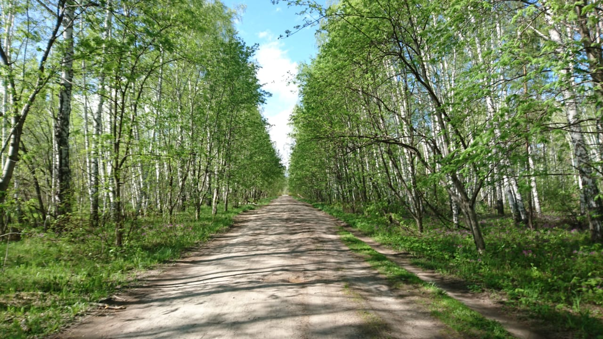
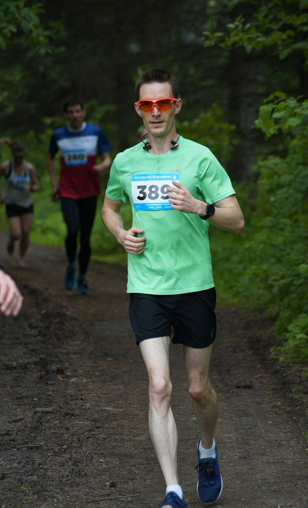
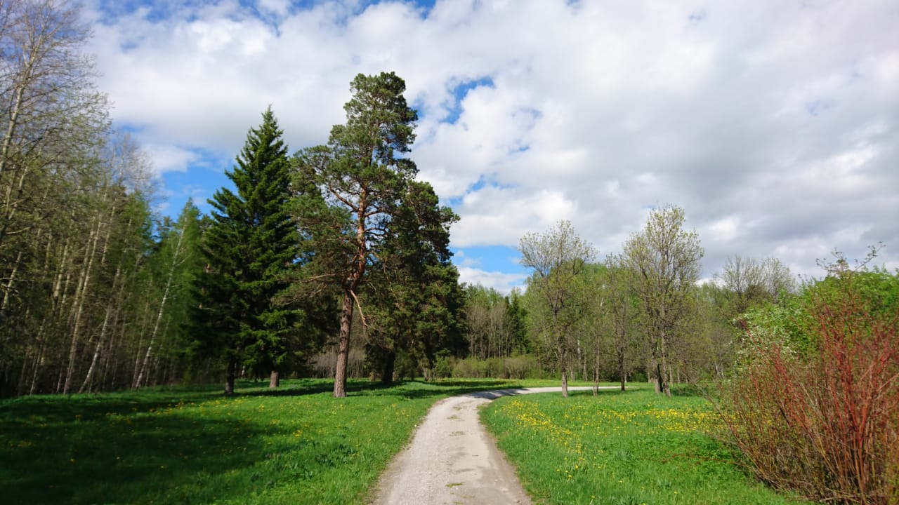
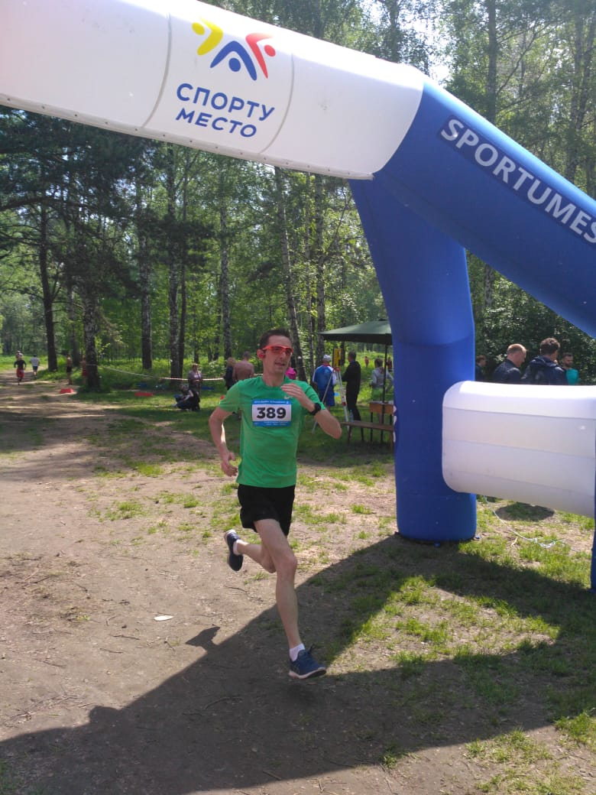

Впервые о забеге с такой фамилией я услышал сразу после второго в своей жизни полумарафона (ЗаБег.РФ). Впечатления о том забеге были еще горячи, и на их фоне предложение пробежать через две недели еще 22,5 км (даже не 21), да еще по пересеченной местности со всеми ее косогорами, корнями, кустами и прочим звучало, мягко говоря, авантюрно.

Я на всякий случай взял паузу, сделал вид, что подумал, а затем тактично отказался, мотивировав это тем, что уже совсем скоро состоится Гонка Героев, и мне надо готовиться к ней. Очень удачная подобралась отмазка.

Прошел год. Моё беговое портфолио потолстело еще на два летних полумарафона и один зимний (лыжный). Сев еще в апреле планировать свой летний спортивный сезон, я вновь вспомнил о пробеге Рыцарева и на сей раз задумался по-настоящему: это близко (в полюбившемся мне Академгородке), бегать по лесу мне нравится, ботанический сад привлекает красотой, а с лыжной базой Алика Тульского меня связывают еще теплые воспоминания о недавно завершившемся лыжном сезоне. Вот только рельеф трассы все еще оставался мне неведом, а это могло таить в себе неприятный сюрприз — немаленькая полумарафонная дистанция, помноженная на перепады высот, могла оставить меня без сил весьма скоро и этим превратить остаток забега в самоистязание. Как следствие, нужно было решить, в чем бежать — мой богатейший арсенал беговой обуви из двух пар не включал в себя вариантов для бега по пересеченке, так что этот момент тоже нужно было как-то учесть. Конечно, можно было хорошенько погуглить, поговорить с бывалыми бегунами и таким образом добыть недостающую информацию, но я решил оставить эти варианты на запас, а основным принять пресловутую народную мудрость: *“Лучше один раз увидеть, чем сто раз услышать”*, и свою следующую тренировку наметил прямо на трассе предстоящего забега. Однако не все оказалось просто — дистанция пролегает по естественной пересеченной местности, испещренной тропинками и дорожками, не имеющими отношения к трассе, поэтому свернуть на ней не туда или не свернуть вовремя — как два байта переслать. Благо, задумался я об этом заранее и загрузил в свои спортивные часы трек с предыдущего забега. Сама эта технологическая возможность настолько восхищала меня, что все остальное казалось мелочью — теперь возьми да пробеги по этой линии, делов-то... Но вот как раз тут и крылся подвох — интерфейс часов оказался не совсем очевидным, и вместо ведения по заданной траектории я бежал первый круг в режиме “Поиск начальной точки”. Из-за этого первый круг получился некорректным (короче на 500+ м), зато я вдоволь налюбовался красотами тамошних мест, пофотал, понял, чего ждать от трассы, и следующий круг побежал уже в относительно полную силу и с ведением по заданной траектории. По окончании этой тренировки решил для себя, что могу заявиться на все 3 круга (22,5 км) и что буду бежать в своих обычных шоссейно-асфальтовых кроссовках. Картинка начала проясняться…

Спустя неделю, утром в день старта (10  июня) я прибыл на правую сторону лыжной базы А. Тульского. На дворе стояло влажноватое летнее утро — легкий ночной дождик еще напоминал о себе прибитой пылью и щекотливо-мокрой травой. Небо было затянуто светло-серым лоскутным одеялом из туч с непонятными намерениями: то ли они готовились превратить этот старт в Гонку Героев с грязевыми ваннами, мокрыми обтягивающими футболками и скользкими спусками, то ли собирались просто разойтись по домам. Как бы там ни было, лютой жары ничего не предвещало, и это хорошо.

Я получил номер, купил пакетик бескофеинового энергетического геля, переоделся в машине и уже исподволь начал потихоньку мандражировать перед стартом. Чтобы как-то отвлечь себя от этого увлекательного занятия, решил наведаться в замеченный неподалеку полевой общественный туалет. Местечко оказалось уж очень общественным; мандраж действительно сменился; в последний раз испытывал такое при первом просмотре хоррора Silent Hill в 3D. Вспомнив совет бежавшего в прошлом году коллеги о защите от комаров, искупался в Рефтамиде и отправился на стартовую поляну, хотя до старта было еще довольно много времени. Встретился с другим коллегой, мы вместе пробежали несколько сотен метров в качестве разминки. Но вот близится момент старта; народу на поляне с каждой минутой становится все больше; ведущего мероприятие мужчины перестало быть видно из-за толпы, поэтому приходилось смотреть лишь на усиливавший его голос динамик, возвышавшийся на подставке. Вдруг даже звук динамика начал забиваться нарастающими прерывистыми голосами людей, и я понял — это обратный отсчёт. Последние цифры счета произносились почти криком, а финальную отметку сопроводила яркая сигнальная ракета с оранжевым шлейфом, и вся людская масса в 400 человек, уже начавших имитировать бег на месте, наконец, пришла в движение. Как и следовало ожидать, первые сотни метров творилось настоящее столпотворение — огромный людской рой в хаотичной диффузии трансформировался в длинную вереницу, сжимаемую узкими границами проселочной дороги. К своему не самому приятному удивлению я обнаружил, что оказался даже не в середине этой вереницы, а в ее дальней, медленной половине, что сулило долго пробираться к бегунам комфортного для меня темпа. К счастью, толпа трансформировалась довольно быстро, а узкая проселочная дорога сменилась широкой лесной аллеей, где обгонять было уже совсем легко. Я обходил одного человека за другим (разумеется, это были, в основном, женщины зрелого возраста, пожилые мужчины или совсем юные бегуны) и слышал, как тяжело они дышат на этой, казалось бы, еще совсем маленькой дистанции. Это порождало двойственные чувства: с одной стороны, я был рад и даже горд за них, ведь несмотря на трудность они все-таки бегут, с другой — представление себя на их месте, но с моей дистанцией, навевало на меня жуть, ведь если бы я дышал так уже сейчас, то что будет через 20 км? Даже думать об этом не хочется… А меж тем мой пульс достиг средних для меня 169 ударов в минуту, и мы добежали до развилки — места, после которого встречный поток бегунов пролегает уже по другой дороге. 

Я стал пытаться вспоминать правильную технику бега и контролировать положение стопы при ее приземлении и отталкивании. Получалось так себе — то ли еще не разогрелся, то разухабистая почва не давала; я решил особо не усердствовать, чтобы не утомить себя этим раньше времени, и оставил акцент лишь на ширине шага — не хотелось мельчить, зная, что впереди еще почти вся дистанция. Народ продолжал комбинироваться, словно в шахматах — одни внезапно обходили других и отрывались, а через минуту обнаруживали себя опереженными недавно отставшими бегунами. Так мы добрались до резкого спуска к озеру (пруду) Ботанического сада, где я изрядно отстал от своих спутников, так как побоялся ускоряться на каменистой дороге. Психологического настроя с лихвой хватило, чтобы отпустить их вперед без резких контрмер; я даже еще немного сбавил за счет того, что зарулил на первый пункт питания, откуда урвал стаканчик воды. Он был наполнен на половину, глотка на три: первые два отправились в распахнутый рот, попутно умыв лицо не попавшими остатками, а третий целиком был отправлен за шиворот — к тому времени тело прогрелось и с благодарностью приняло порцию прохладной водички на спину. Темп был немного утрачен, но я знал, что именно здесь, именно в этом месте это как нельзя кстати — впереди долгий и сложный подъем. Тот самый, о котором со вздохами вспоминали все, кто уже бегал эту дистанцию, и тот самый, который на тренировке неделю назад заставил меня запыхтеть так, как не приходилось с ранней школьной поры, когда бег казался мучением. Я побаивался этого подъема и потому приближался к нему с осторожностью, даже перехваченную воду попытался подольше подержать во рту, чтобы грядущая нагрузка не дала пересохнуть горлу. При всей своей сложности подъем обладал и позитивной стороной — он был тенистым, это позволяло более трезво оценивать свои силы на нем и не погружаться в уныние. Преодолев его первую “ступень” (набирающий высоту отрезок с пологой частью в финале), я вспомнил, что еще на той пробной тренировке решил особо контролировать постановку стоп — на подъеме было нельзя позволять им опускаться ни на пятку, ни на носок, это сильно выбивало из сил. Кроме того, здесь я позволил себе сократить ширину шага до комфортной. Единственное, что хотелось сохранить, это частоту шагов, чтобы не заставлять и без того нагружаемый организм адаптироваться к лишней смене. Прогрузив эти инструкции в память, я отправился на третью, самую длинную и крутую ступень подъема. На этом пути довелось обогнать несколько бегунов, и это изрядно смутило — а может, они что-то знают и поэтому бегут с осторожностью? А вдруг я сейчас сдохну, и они обойдут меня как стоячего на самом финале подъема? С этими тревожными мыслями я достиг верха, где трасса стала почти пологой, и принялся тщательно прислушиваться к ощущениям. Пульс, конечно, был высоким, за 180, дыхание заметно шумнее (раньше я практически не слышал себя), ноги пребывали в некотором недоумении от произошедшего, но мозг уверенно транслировал: “Ребята, вы молодцы, но это только первый круг, нам такое еще два раза повторить придется, не расслабляемся.” На восстановление пульса ушло еще около трех минут, впрочем, этой оценке можно верить с большой натяжкой, так как мое восприятие времени очень сильно зависит от уровня активности организма. Я много раз замечал, какими стремительными кажутся секунды на часах при наблюдении за ними в спокойном, ленивом состоянии. И несколько раз с удивлением отмечал для себя, что бешеный ритм drum’n’bass трека кажется неспешным вальсом, если оценить его после ускорения в финале беговой тренировки. Выровняв дыхание до прежнего уровня, я прибавил темпа за счет напоминания себе о ширине шага; благо, текущий участок трассы вновь стал почти пологим. 

Навстречу стали попадаться бегуны второго круга — их красные лица источали усердие и сосредоточенность, а общий образ почему-то порождал в моей голове только одну, но четкую мысль: “Они бегут всем телом.” Это заставило меня вспомнить о том, что так и должно быть — в правильном беге участвует практически все тело, не стоит заставлять отдуваться за него одни только ноги. Мысленно шлепнув себя по затылку за то, что не вспомнил об этом вовремя, я чуть выпрямился, начал интенсивнее работать руками и больше помогать торсом. Это придало некой уверенности в себе. Бежавший впереди меня парень внезапно резко свернул направо, и я понял, что первый круг позади, мы заходим на второй. Из-за этой мелкой неожиданности ни один стаканчик с водой на пункте питания не удостоился быть схваченным мною. Не то чтобы мне хотелось пить, но советы бывалых бегунов о том, что на длинной дистанции обязательно нужно регулярно пить и питаться, заставляли задуматься о последствиях такого пропуска. Впрочем, вскоре я о них забыл — на втором круге трасса была заметно менее населенной, а его первые километры имели небольшой уклон вниз, за счет чего бежалось по нему довольно легко и приятно. Войдя в сложившийся ритм бега с головой, я лишь пассивно наблюдал, как мягкая дорожка лесной аллеи сама уходит под меня, словно я не бегу, а парю на месте на небольшой высоте. В то же время порой казалось, будто я, подобно Лангольеру, поглощаю пространство перед собой с неизменной скоростью. Медленно, но верно я обошел несколько бегунов и вновь очутился у пруда Ботсада. Выплеснув в себя и на себя стаканчик воды по отработанной схеме, я отправился на второй подъем. Смущение моё вновь начало подогреваться, но на сей в самом начале подъема — группа не кажущихся начинающими бегунов вдруг резко сдала темп перед первой же ступенью, за счет чего я без напряга обогнал их и пошел на вторую ступень. Впрочем, напряг все же был — совесть. Однако начавшаяся вскоре знаменитая третья ступень заставила забыть не только про совесть, но и про многие другие кажущиеся непреложными атрибуты личности. Не особо стараясь делать это специально, я отключился от всего, кроме этой каменистой дороги и контроля над постановкой стоп. Склонил голову так, чтобы не видеть дальнейшего подъема — его вид не добавлял сил, а когда он закончится, я все равно об этом узнаю, сейчас нужно только бежать. Так, погрузившись в себя, я добрался до верха и вновь принялся восстанавливать дыхание. На удивление, это удалось сделать довольно быстро, и я вскоре обошел пару бегунов, для которых, видимо, подъем прошел заметно тяжелее. На этом участке захотелось ускориться, но я счел это опрометчивым и отказался — впереди еще больше круга, силы могут понадобиться. Вскоре за поворотом показалась знакомая узкая проселочная дорога, и в голове вдруг всплыла напоминашка — у меня ж гель, пора! Пора потому, что если я выпью его сейчас, то в конце круга смогу запить его на пункте питания. Такой план показался годным, и я принялся извлекать пачку геля из поясной сумки. Это действие, равно как и последующее вскрытие пачки, дались весьма коряво. Как попало открытая пачка при сжатии выдавала гель не только в рот, но и на руку, благодаря чему пальцы вскоре смогли держать ее почти без усилия — тупо прилипли. К слову, гель оказался не таким уж противным, как я ожидал. Четко к финишу второго круга я разделался с гелем и приготовился хватать стаканчик с водой со стола. Сделать это удалось, но фиаско было буквально за углом — скользкая рука едва удержала гладкий пластик стакана. Условно сытый, я был полон сил для преодоления третьего круга, но уделанные в геле пальцы доставляли изрядный дискомфорт. Платочка у меня с собой как-то не нашлось, поганить любимую футболку рука не поднималась, поэтому пришлось обходиться подручными средствами, точнее, ртом — я принялся слизывать гель с пальцев, чтобы хоть как-то подготовить их к финальной очистке. Бежавшие навстречу люди, вымотанные пересеченной дистанцией, изрядно оживлялись, замечая перед собой парня, с причмокиванием облизывающего собственные пальцы на бегу. Их лицами овладевало недоумение, а у некоторых сразу намечалась улыбка. Быть может, помог кому-то справиться с трудной дистанцией. Чтобы добить тему, я надергал листьев с прилегающих к просеке кустов и вытер ими ладони. Теперь баланс в этом мире был восстановлен. 

По сложившейся традиции я решил включить приготовленный заранее плеер лишь на последнем отрезке дистанции — здесь им был, очевидно, третий круг. Бодрящая музыка в ушах, уютная лесная аллея, выглянувшее из-за облаков солнышко и недавний перекус сформировали ощущение невероятной легкости, а понимание оставшегося расстояния позволило не сдерживать это рвение, и я ускорился. Причем сделал это не частотой шагов, а их шириной — бросал ноги вперед, пролетая за каждый шаг куда больше, чем в предыдущие два круга. Плюс к тому, на третьем круге очень много участников забега отсеялись за счет более коротких дистанций, а оставшиеся настолько растянулись по трассе, что их не было видно даже на горизонте, я бежал один. В какие-то минуты сочетание этих пустяковых обстоятельств настолько воодушевило меня, что я бежал с широкой улыбкой на лице, наслаждаясь каждым шагом, своим состоянием и не торопя время. Это отчасти удивительно, но такое состояние наступает только в уже продлившейся тренировке, когда отработано немалое расстояние, а организм не просто разогрелся, а “обжился” в новом рабочем режиме. Добежав на такой волне до пункта питания при ботсадовском пруде, я с удивлением обнаружил, что темп предыдущего километра превышает все предыдущие. Зная, что впереди подъем, я решил пока не зверствовать и приберечь остатки сил для него. Наметив траекторию для резкого поворота у стола с водой, я замахнулся на первый замеченный стаканчик и… промазал, рука ушла ни с чем. Пришлось резко дать по тормозам, выполнить какой-то непонятный даже мне разворот с прошлифовкой, ухватить другой стакан и только после этого бежать дальше. Этот эпизод слегка сбил дыхание и, наверно, повеселил людей у стола, но зато заставил немного отрезвиться и приготовиться к третьем подъему. С ним я остался почти один на один. Лишь пара мужчин, вероятно, преодолевавших еще второй круг, поднимались в него в полупешем режиме. Я вновь включил свой “режим социопата” и, пребывая в нем, преодолел весь третий подъем, хоть на этот раз пульс подскочил выше прежнего. Оказавшись на вершине подъема, я почувствовал не столько физическое, сколько психологическое облегчение, ведь теперь силы можно было почти не экономить, всё самое трудное позади. Восстановив дыхание, я ускорился и постарался удержать взятый темп. К счастью, это удавалось делать, хотя ноги отчетливо “говорили” о том, что в них накапливается усталость. Я мысленно убеждал себя в том, что до финиша осталось совсем немного и что все силы можно бросить на его приближение. В этом убеждении была преодолена последняя лесная аллея, и еще недавно оживленная, а ныне совсем безлюдная дачная просека предстала как пустой, словно манящий финишный коридор. Я принял этот вызов и добавил темпа еще. Пара бегунов, казавшихся на прошлом круге мне недостижимыми, вдруг были настигнуты мною и остались позади, а впереди сквозь музыку в ушах уже слышались звуки стартово-финишного городка. Последние секунды превратились в абстракцию — я видел лишь цветное пятно финишных ворот и с каждым шагом устремлял себя вперед, делая акцент на пролёте между шагами, а не на их частоте. Быть может, кто-то кричал мне что-то или махал, но я не видел.

Влетев на полной скорости за финишную черту, я стал потихоньку сбавлять темп, но останавливаться не торопился: во-первых, организаторы просили не останавливаться сразу на финише, во-вторых, я помнил, как “колбасило” меня после прошлых полумарафонов и мне хотелось максимально сгладить этот переход. С этой целью я еще с полминуты бегал по 3-х метровому кругу, прыгал на месте, махал руками — словом, восстанавливался как мог. Вскоре ко мне подошел мой хороший знакомый, и мы вместе пошли смотреть результаты забега. К чести организаторов, результаты вывешивались очень оперативно, и уже через несколько минут после финиша я нашел себя в вывешенном протоколе на 11 месте в своей возрастной группе с результатом **1:44:55,5**.

Я не берусь сравнивать этот результат ни с каким другим — это был первый забег такого рода для меня. Однако он подарил мне столько позитивных эмоций, что в следующем году я наверняка захочу повторить его вновь. Очень надеюсь, что мне удалось передать ту невероятную спортивную эйфорию, которой наполнил меня этот старт, и она поможет решиться на него вновь не только мне...

<iframe height='405' width='590' frameborder='0' allowtransparency='true' scrolling='no' src='https://www.strava.com/activities/1628523134/embed/2ecad4cc2c182d9e44ca30dc8b0a42da3351a728'></iframe>