“Блин, я тоже хочу!” — подумал я, прочтя год назад заметку [Игоря Родионова](https://www.strava.com/athletes/19377954) о его участии в SwimRun — спортивном соревновании, где участники преодолевают смешанную серию беговых и плавательных этапов на пересеченной местности безо всяких транзитных зон, т. е. и бегают, и плавают в одной экипировке. Им разрешается использовать носимое снаряжение (ласты, лопатки и т.п.), но с условием: всё, что взято с собой на старте, должно быть принесено на финиш. В Новосибирске эти соревнования ежегодно проводятся в районе левобережной насыпи Октябрьского (Коммунального) моста. Там на выбор участников размечены две трассы: 4 и 9,8 км. В большую трассу входят 9 этапов: 5 беговых и 4 плавательных, из которых 2 проходят по прудам и 2 — по реке.

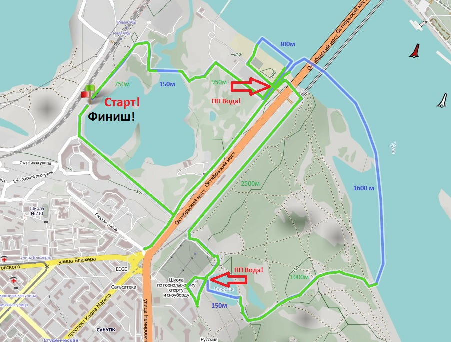

И хотя я ни разу раньше не выступал на таких стартах, весь этот год мне хотелось преодолеть именно большой круг. Однако незадолго до дня проведения выяснилось, что на большой круг можно зарегистрироваться только в составе парной команды, а в личном зачете участие допустимо только на малом круге. Напарника у меня не было, поэтому пришлось записаться на 4 км. Это слегка обескуражило меня, но не расстроило: все-таки это первый раз, старт непростой, 1000 и 1 вещь может пойти не так, мало ли…

Особенно много вопросов было с экипировкой: нужно было снарядиться так, чтобы было удобно и бежать, и плыть. На плавании основную проблему составляют ноги: по идее, им нужно давать отдохнуть между беговыми этапами, но если ими не грести, они начинают тонуть под весом намокших кроссовок. Чтобы этого избежать, некоторые опытные спортсмены привязывают к ноге плавательную калабашку — кусочек очень плавучей синтетической пены. На бегу ее держат на внешней стороне бедра, а перед плаванием зажимают между ног, и она поддерживает их на плаву. Чтобы не терять скорости в плавании из-за отдыха ног, многие также надевают на руки лопатки — они увеличивают захват воды при гребке и делают его более эффективным. Так решил поступить и я, снарядившись к старту в такую экипировку:

- обычные свои беговые кроссовки (в надежде, что они за счет легкости не будут сильно тонуть);
- неопреновые шорты (взятые в прокат у тренера по плаванию);
- плавательная калабашка, привязанная к ноге резинкой (проделывать дырки для резинки не стал — показалось, что и так держится; к тому же калабашка обошлась почти в 500 руб. — рука не поднялась их дырявить);
- обычная приталенная синтетическая беговая футболка (чтобы не бежать голышом по крапиве, но и чтобы одежда не “парусила” на плавании, сопротивляясь воде);
- плавательные лопатки (постоянно одетые на руки);
- плавательные очки (во время бега — на лбу, при плавании — на глазах).

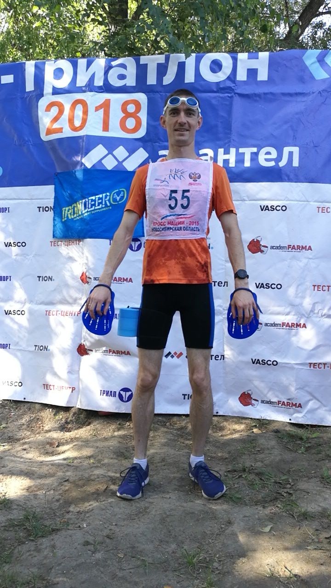

Стартово-финишным городком для SwimRun послужила баня №2 на базе отдыха Атлант — обычный деревянный домик у пруда со своим небольшим двориком. Место это мне практически сразу понравилось. С дворика спускалась деревянная лестница, ведущая на берег пруда. А с него открывался великолепный вид на неподвижную водную гладь пруда, в которой отражались еще только восходившее солнце, витиеватый рельеф дальнего берега и широкая стена новостроек возводимого рядом жилого комплекса. Тихим это место не назовешь: почти над головой иногда пролетали самолеты, заходившие на посадку в Толмачево, а в 50 м от бани по высокой насыпи проносились поезда и электрички.

Когда открылась регистрация, я подошел к ее столику, чтобы отметиться и внести стартовый взнос. К тому моменту я уже ознакомился с планом дистанции, понял, что она будет несложной, и предвкушал легкую 4-километровую пробежку с двумя небольшими погружениями в воду. Окружавший пейзаж и нега теплого летнего субботнего утра подавили предстартовый мандраж, я был спокоен и уже немного доволен происходящим. Регистрировавший меня парень внезапно задал вопрос:

— А хочешь пробежать полную дистанцию?

Я слегка растерялся:

— Так в одиночку 9 км нельзя же было…

— А теперь можно. Побежишь?

От неожиданности я настолько опешил, что… согласился. На этом моему спокойствию пришел конец. С одной стороны я был рад, ведь весь предыдущий год я представлял себе именно полноразмерный старт, на 9 км. С другой — я по-прежнему оставался новичком и ничего не страховало меня от неудачи, если что-то пойдет не так. Чтобы не давать мандражу разыграться и взять надо мной власть, я вновь спустился на залитый солнцем берег пруда и принялся разминаться. Эти утренние потягушки под пение птиц и еще не высокое солнце сделали своё дело: я вышел на старт довольно спокойным и воодушевленным, даже успел сделать разминочную пробежку за время задержки старта.

Наконец-то раздался стартовый свисток (в роли свистка выступил главный судья соревнований Константин Рогачев), и вся наша пестрая команда в 33 человека рванула прочь от забора бани вдоль по проселочной дороге. Вместе с нами побежал и организатор этих соревнований Евгений Бахирев. Он со своим напарником стартовал где-то в хвосте и на протяжении всего первого бегового этапа (750 м) выкрикивал оттуда всякие подбадривающие фразы:

— А вон те орлы впереди всех куда рванули-то? Вы хоть знаете, куда бежать, а? Трассу-то я размечал!

Через 2 минуты после старта:

— Ой всё, давай назад, в баню!

— А может, споём, а? Давай нашу!

К слову, на финиш их пара пришла первой.

На фоне его кричалок я неспеша обошел пару-тройку человек и уже приготовился обходить следующего, как бегущая вереница внезапно свернула направо, и неровная, но довольно широкая проселочная дорога резко сменилась одноместной тропинкой среди густой травы по пояс высотой. Пришлось выстроиться в одну колонну и бежать, дыша друг другу в затылки. К счастью, длилось это недолго — довольно скоро мы выбежали на берег первого пруда (150 м), где нас встречали… аплодисменты — десятка полтора рыбаков и отдыхающих уже расположились на берегу, они были удивлены появлением толпы спортсменов и решили поддержать их.

Купаться в лучах славы было некогда — берег узкий, а до входа в воду надо успеть надеть очки, заправить калабашку между ног и проверить лопатки. Я это сделал, забежал до бедер в воду, которая показалась мне прохладной (что не удивительно) и прыгнул в нее, сразу же включившись в гонку.

В первые несколько метров образовалось небольшое месиво из одновременно стартовавших пловцов; я чуть не получил пяткой в нос, но вскоре мы разбрелись, и каждый поплыл своим путем. Памятуя опыт акватлона, когда у меня после первого погружения в воду сбилось дыхание, я решил не выходить сразу на три гребка между вдохами, а дышать почаще; это сработало. Я тут же вспомнил рекомендацию тренера акцентировать работу руками на плавании, а ногами — на бегу (чтобы и те, и другие отдыхали). И тут меня пронзила мысль: “Ноги! Я же ими гребу как сумасшедший! А где моя калабашка?!” Оказывается, все это время я работал ногами, как привык это делать при погружении в воду бассейна, и напрочь забыл о калабашке, которую нужно было зажать и держать неподвижно между ног. Я перестал ими грести, но нащупать потерю не удалось; видимо, она вновь переползла на внешнюю сторону ноги. Наполненные водой кроссовки начали постепенно тонуть вместе с ногами, и я понял, что этот этап придется проходить в обычном плавательном режиме, отдохнуть ногам не светит. Этот и все последующие водные этапы я проходил кролем, лицо было погружено в непрозрачную воду, поэтому для ориентирования приходилось при некоторых гребках выгибать спину назад, приподнимать голову над водой и на долю секунды бросать взгляд вперед. Я стал поглядывать так в сторону противоположного берега и с удивлением заметил, что другие пловцы были от меня и сильно левее, и заметно правее — единого направления не было. Чтобы не метаться, я решил продолжить плыть своим путем, и лишь изредка поглядывал на остальных. Этот путь привел меня к берегу не совсем там, где нужно было, но это было мелочью — других вынесло на берег и того дальше.

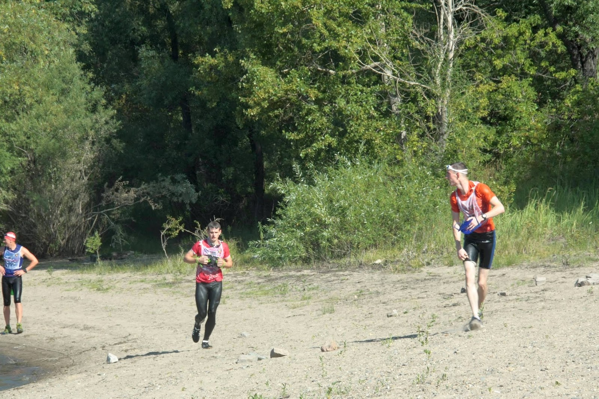

Выбежав на песок, я решил поправить сползшую калабашку и… не нашел ее, болталась только резинка. “Лучше б я продырявил эти 500 рублей,” — подумал я и побежал дальше. А дальше нас ждали 950 м по суше: нужно было пробежаться по песчаному берегу и нырнуть в очередную узкую тропинку, поросшую какой-то густой травой. И хотя берег был совсем узким, его преодоление заставило изрядно попыхтеть — переход с плавания на бег почему-то напрочь сбил дыхание, ноги в мокрых кроссовках вставали на песок как попало и, конечно, ни о каком ускорении не могло быть и речи. Я пропустил вперед смешанную команду из Алены и Стаса, а сам легонько побежал за ними, чтобы восстановить дыхание. Бежать становилось все легче, и я уже начал подумывать об обгоне, как вдруг заметил, что мы бежим.. в зарослях высоченной крапивы. Об этом участке на брифинге с ухмылкой говорил Евгений: “Вот мы там и посмотрим, кто экипирован по правилам, а кто бежит голышом.” Обгонять я, естественно, передумал, но крапива все равно пару раз прижгла мне руки, впрочем, на тот момент это было практически не заметно. Вскоре мы выбежали на обещанную брифингом широкую асфальтовую дорожку, где я уже без всякого зазрения совести обошел ребят и даже принялся наращивать темп еще выше. Уже слегка довольный собой, я вдруг почувствовал легкие биения в области стоп, взглянул вниз и понял, что минута славы окончена — намокшие от воды шнурки развязались. Чертыхаясь и понося себя за то, что не сменил эти обычные шнурки на триатлонные затяжки, я остановился, присел, выстегнулся из лопаток и принялся как попало заматывать шнурки обратно. Заодно выбросил ставшую бесполезной резинку от калабашки. Стоит ли говорить, что Алена и Стас за это время уверенно ушли далеко вперед? Да и мои дыхание с пульсом изрядно упали. Я продолжил бег и начал мысленно убеждать себя, что это всё в первый раз, такое бывает, тут главное не победа, а участие, и вообще здесь клево — светит солнышко, шумит травка, можно просто бежать в свое удовольствие. Последние аргументы почему-то подействовали лучше всего. Тем временем, я достиг входа на пляж Наутилус, где был первый питьевой пункт и откуда предстояло преодолеть второй плавательный этап в 300 м по течению реки.

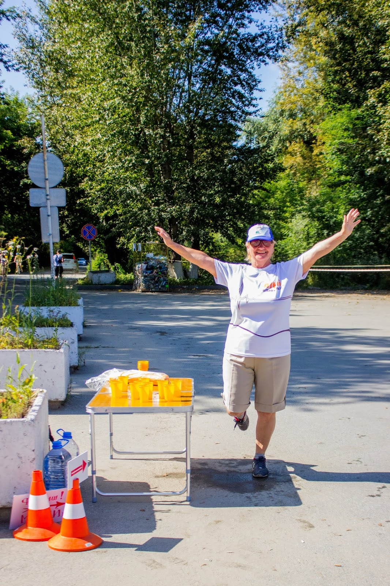

Здесь же я вновь догнал убежавшую от меня пару, но брать над ними реванш было не уместно — дорога вновь стала узкой, а после нее сразу начинался песчаный пляж, поэтому пришлось дышать им в спину вплоть до входа в воду.

Мы довольно лихо ворвались в реку и устремились к плавучему шару, за которым предстояло проплыть по течению около 200 м. До шара я как-то пересекался с парой Алены и Стаса, но за ним они обошли меня: видимо, моя не приспособленная для плавания одежда не позволяла развить такую же скорость. Да точно — дело только в одежде. Я не особо огорчился, зная, что Алена — титулованный пловец, да и Стас, видимо, бывалый. А вот внезапное приближение сзади какого-то другого одиночного пловца, да еще брассиста, заставило поволноваться. Я ускорился; он тоже особо не отставал, заступив на меня на четверть корпуса. В этой зарубе мы добрались до второго буя, и лишь на этом повороте он все же пропустил меня вперед. Доплыв до берега, я стал выходить на сушу, и здесь меня ждала вторая волна “спецэффектов” от перехода с плавания на бег: сердце колотилось где-то в горле; мокрые, набухшие от воды кроссовки вязли в песке; вымокшая футболка как попало натянулась на груди и мешала дышать. Но нужно было бежать, причем бежать на подъем, поскольку это выход из воды на сушу. Я почти перешел на шаг, когда стал замечать что получаемая от глаз картинка обзавелась виньеткой — темной областью по краям. К счастью, вскоре картинка восстановилась, подъем сменился нулевым уклоном, и впереди меня ждала…

Тенистая асфальтированная аллея длинной около 100 м расположилась между береговой линией и парковкой пляжа Наутилус. Едва выбежав на нее, я почувствовал себя гораздо лучше. Причиной тому стала не отлипшая футболка и даже не отдых после водной зарубы, а … воспоминания. Чуть больше восьми лет назад я, будучи непонятно кем — уже не студентом, но еще и не призывником — бегал здесь летними вечерами, когда доживал последние денёчки в студенческом общежитии. В этой ностальгии я пробежался по солнечной и тенистой полосам аллейки, восстановил дыхание.

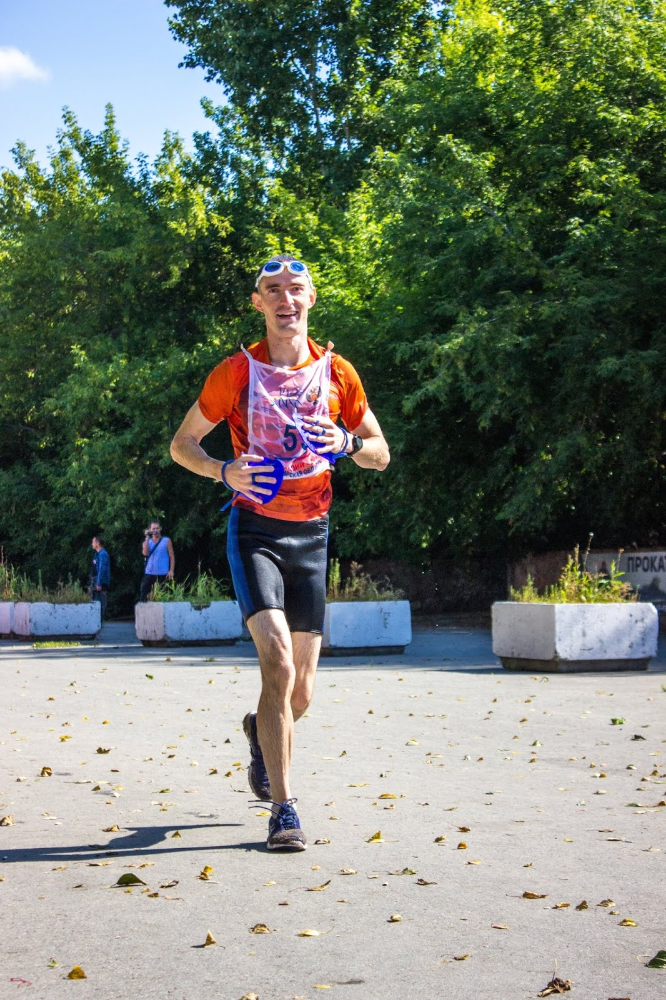

Уже совсем близко вновь замаячили фигуры Алены и Стаса. “Знакомые все спины!” — подумал я и стал невольно слышать их разговор по мере обгона. “Всё-таки плавание мне нравится больше,” — сквозь сумбурное дыхание роптала Алена. Я обошел ребят прямо под автомобильным мостом и сразу за ним свернул направо, где предстояло бежать прямо около 2 км практически под метромостом, по совсем не парадным, но таким же памятным местам, отдававшим студенчеством. Где-то в недосягаемой дали мелькнули спины лидеров и тут же исчезли за поворотом, а сзади за мной никого поблизости не было. Однако к концу участка за спиной обозначился соперник — его темп бега был чуть выше моего и за этот прямой отрезок он сумел здорово приблизиться. Вероятно, это был тот же, кто дышал мне в затылок на последнем плавании. Я прибавил ходу, не подпуская его к себе, однако вскоре прямой участок сменился извилистой проселочной дорогой внизу горнолыжного спуска, где уже не стоило ускоряться. Эта дорога привела нас к подъему — предстояло подняться на один из лыжных спусков, прямо к наблюдательной будке, которая отсюда, снизу, казалась маленьким черным квадратиком на недосягаемой высоте. Мой напарник догнал меня здесь; это был поджарый мужчина лет на 10 старше меня, в соревновательной майке с какими-то надписями про Тюмень. Вспомнив опыт подъема в гору на пробеге Рыцарева, я включил “режим социопата” и принялся тихонько, но равномерно перебирать ногами, преодолевая подъем буквально по сантиметрам. Вопреки ожиданиям, такой подход почти не сработал — подъем был настолько резким и затяжным, что ноги вставали на него как попало, а дыхание довольно быстро вышло из-под контроля. Дело усугублялось тем, что почва здесь была глинистая, испещренная дождевыми ручьями, поэтому кроссовки цеплялись за нее едва-едва. Ближе к верху я понял, что дальше упираться бессмысленно и опасно — можно поскользнуться и упасть — поэтому все же перешел на шаг, упираясь руками в колени и стараясь сильно не сбавлять темп. И хотя это в каком-то смысле означало сдаться, в этом был и плюс — я смог оглядеться и, в частности, увидеть, что соперник отстал, так как ему, судя по всему, было еще тяжелее. Кое-как добравшись до самого верха и слабовато представляя, что вообще происходит, я машинально свернул налево за будку, дальше по верху горы, пытаясь выровнять разболтавшееся дыхание и технику бега. Пробежав так несколько десятков метров, начал высматривать очередную метку трассы, но никак не находил ее. Больше того, увидел, что если так бежать дальше, то я окажусь на… стройке — впереди, безо всяких заборов начиналась строительная площадка нового жилого комплекса. По ней как ни в чем не бывало ходили строители в касках, таскали какую-то арматуру. После всего того, что мы повидали на этой трассе, я бы не удивился, если б нам реально предстояло пробежать через стройку, но даже сквозь усталость я точно помнил, что на брифинге про стройку не было ни слова. Я сбавил ход, чтобы получше осмотреться, и этим дал догнать себя тому мужчине — мы перекинулись парой слов и выяснили, что оба бежим в первый раз и понятия не имеем, куда тут дальше… Стали легким бегом отступать от стройки назад, периодически подбегая к каждому кусту, казавшемуся началом тропинки. Так мы вернулись к будке, из-за которой как раз вырулили два парня в составе команды и, не задумываясь, повернули в противоположную от стройки сторону. “Вот блин!” — мысленно негодовал я, — “Мало того, что этого мужика пропустил вперед, так еще и большой разрыв с этими парнями полностью утратил!” Правда, последний подъем изрядно потрепал парней, так что обогнать их труда не составило, а вот мой “напарник” к тому времени скрылся из виду. Увидел я его лишь в конце этапа, он был далеко… внизу.

Эта извилистая тропинка привела нас к пруду, который в народе называют то “Тарелка”, то “Блюдце”. Однако в отличие от предыдущих переходов, здесь вход в воду был, мягко говоря, не плавным — тропинка обрывалась скалистым выступом на высоте 5-7 м над уровнем пруда. Вода в пруде была, разумеется, непрозрачной, поэтому прыжок в нее с такой высоты казался прыжком в неизвестность. По правилам соревнования можно было не прыгать, а спуститься по тропинке, но этот обход облагался штрафом в +2 минуты финишного времени. Печатая эти строки, я хотел было сказать, что подумал о чем-то там перед рывком, но это было бы сущим враньем — на тот момент я мало о чем думал и, наверно, это стало залогом успеха. Остановись я на пять секунд для анализа обстановки, и на этот прыжок можно было не решиться вовсе. Я лишь мельком взглянул вниз, слегка разогнался, оттолкнулся от края скалы и, издавая какой-то животно-индейский звук, улетел вниз. Группировки как таковой не было; хотел войти в воду “солдатиком”, чтобы смягчить удар, но зачем-то согнул ноги в коленях и стал размахивать руками — словом, исполнил прыжок как профессиональный мешок.

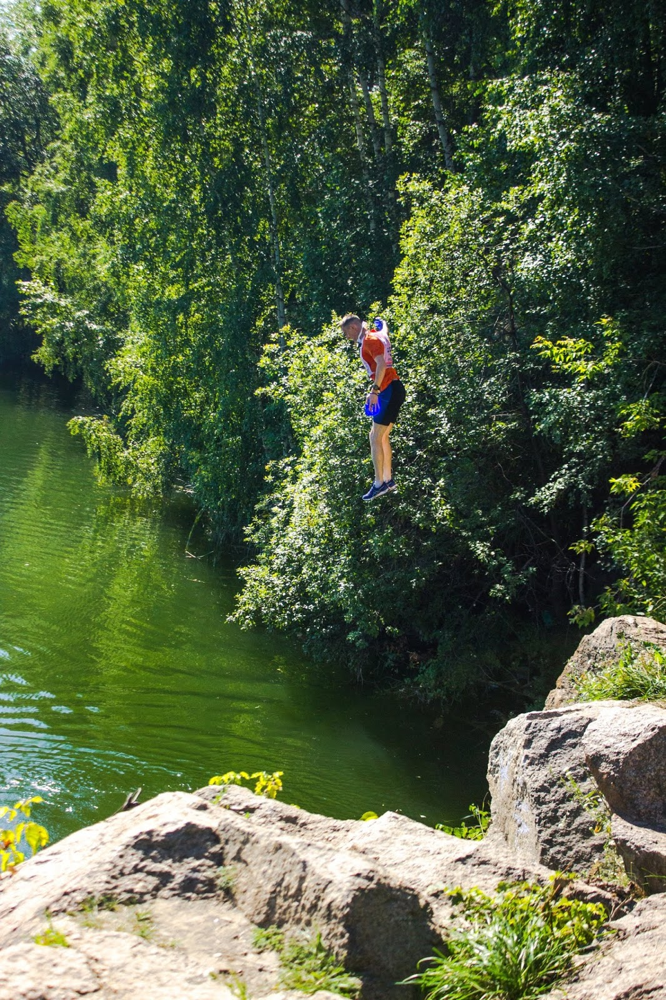

Приводнение оказалось не особо жестким, зато последовавшее погружение в непрозрачную холодноватую воду на непривычно большую глубину изрядно добавило адреналина. На остатках дыхания я выгреб себя наверх, вдохнул воздуха, натянул очки и принялся грести в сторону противоположного берега; до суши было 150 м. Поглядывая по сторонам на гребках, я заметил, что мой соперник был позади и почему-то медленно плыл на спине. “Видимо, взял передышку,” — пришло мне голову и, пока он не очухался, я рванул прочь.

На противоположном берегу виднелись два удобных места для выхода из воды. На одном из них несколько ребятишек тащили что-то из воды на веревке. И хотя я уже решил, что буду выходить из воды на другом, я все же стал поглядывать на ребят, чтобы убедиться, что они тянут не тело предыдущего пловца. Так и не разглядев, что они там делают, я вышел на берег и помчался на следующий беговой этап.

Как ни странно, на этот раз никакого приступа усталости не было. Да, футболка опять обтянула туловище в лучших традициях гей-парадов; да, кроссовки опять казались чугунными валенками, но в целом — вполне норм. Следующий сухопутный километр показался мне очень живописным: сквозь пышные кроны деревьев прорывались теплые лучи солнца, на тропинку стелились еще влажные от росы прутики травы, а птицы наполняли этот пейзаж пением. В голове мелькали воспоминания о проходивших здесь студенческих пикниках, и это делало пробежку еще приятнее.

На этой ностальгической волне я быстро достиг берега, где меня встретил волонтер и вкратце объяснил, что плыть сразу налево по течению нельзя, нужно сначала как следует отдалиться от берега и лишь после этого поворачивать налево и плыть по течению. Это был финальный и самый длинный из 4-х плавательных этапов — 1600 м по реке. Зайдя в воду, я не увидел никаких ориентиров в виде буев или шаров, зато приметил двоих лодочников, один из которых был почти прямо у меня по курсу. Через несколько десятков метров я доплыл до него и спросил где поворачивать. Честно говоря, так и не услышал, что он там буркнул в ответ, зато увидел, что он начал грести веслами в подходящем для меня направлении, и решил плыть за ним. Оказалось, это было верно — он стал буквально вести меня за собой: давал приблизиться и тут же отплывал дальше. Так он вывел меня примерно на ¼ ширины реки и куда-то скрылся.

Пройденный с ним участок показался мне очень долгим — кроме лодочника, все остальные досягаемые взглядом объекты были очень далеки, поэтому в них никак не просматривалось моё продвижение; казалось, будто я просто барахтаюсь на месте, а ощущать себя барахтающимся в холодной непрозрачной воде не особо приятно; пришлось потерпеть. До моста, за которым выход на сушу, было еще так далеко, что я предпочитал на него даже не смотреть. В какой-то момент вода вдруг резко потемнела, а в ее булькании появился какой-то вой… Это заставило меня на очередном гребке почти перевернуться на спину, взглянуть на небо, и я даже слегка опешил — прямо надо мной на небольшой высоте пролетал огромный черный силуэт пассажирского самолета. Он заходил на посадку в Толмачево как раз над рекой, а его тень проскользила по тому месту, где я плыл. Когда плывешь один по широкой реке, а над тобой с воем пролетает такая дура, это впечатляет... Меж тем автомобильный мост перестал казаться таким уж далеким, и я стал целиться в его второй пролет, хотя на тот момент плыл по курсу третьего. Принять влево оказалось не просто — течение очень быстро приближало меня к мосту, а точнее к его опоре. Издали она казалась спичкой, но на очередном гребке я взглянул вперед и едва не предался панике — почти прямо передо мной возвышалась эта гигантская бетонная конструкция в несколько метров шириной; было видно, как об нее разрезается вода, и хорошо заметно, что и меня течение неумолимо приближает к ней.

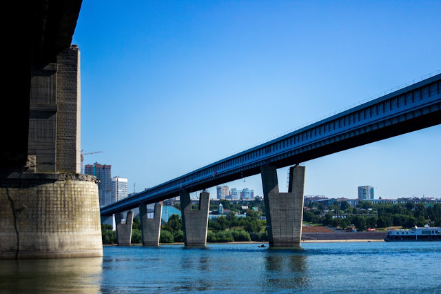

Пришлось вдарить по газам поперек течения, и только благодаря этому удалось избежать бетонных объятий опоры, пройдя всего в 2-3 метрах от нее. Едва я начал грести в обычном ритме, как вдруг лопатка с силой ударилась обо что-то твердое. Я всмотрелся в воду и увидел очень неровное каменистое дно почти под собою. Помнится, тренер по плаванию говорил, что здорово ударился где-то здесь на одном из таких стартов. Чтобы не испортить себе гонку, я встал на ноги и, качаясь, пошел дальше пешком. Оказалось, что уже какое-то время совсем неподалеку был мой приятель-лодочник. Он наблюдал, как я развлекался последние несколько минут, и спросил, не ушибся ли я о камни (видимо, здесь такое бывает частенько). Я что-то буркнул ему в ответ на своем, на swimrun-овском, и прибавил ходу, сняв очки для лучшего обзора каменистого дна. Как оказалось, снял зря — внезапно дно кончилось, и я вновь плюхнулся в воду. Одевать в ней очки, когда на руках лопатки, было крайне неудобно, поэтому я поплыл по-старинке, с головой наверху. Это было медленно, неудобно, но не долго — через 50 метров я почувствовал песок и выполз на берег. Фотограф кричал что-то вроде “Улыбаемся и машем!”, но едва ли моя физиономия на тот момент излучала хоть какое-то подобие радости.

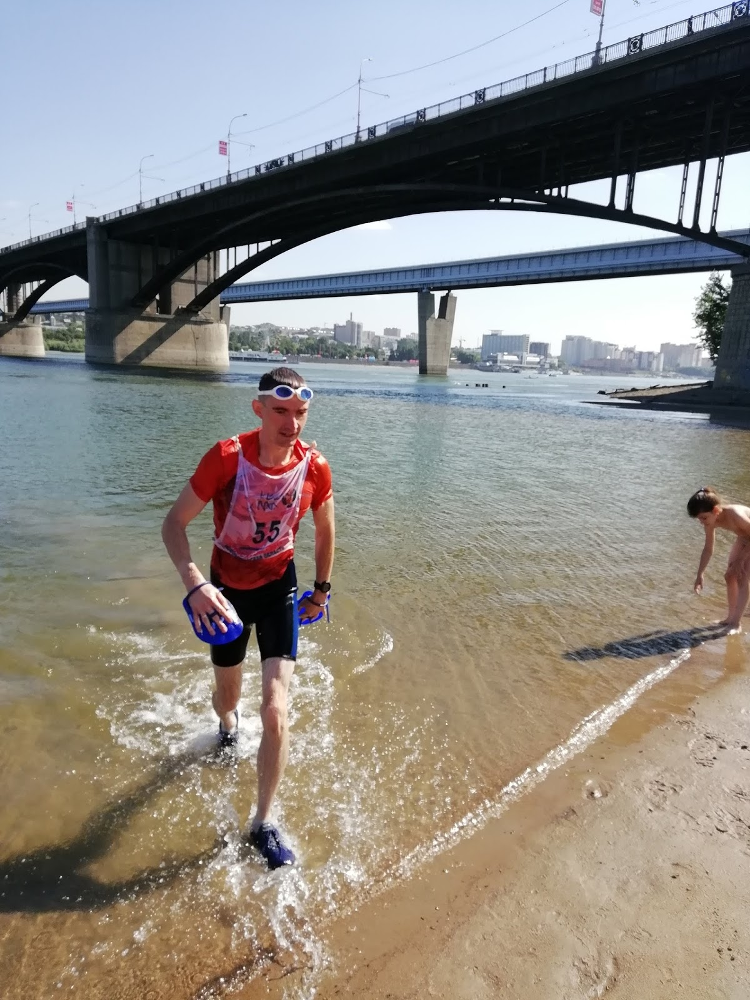

В полупешем режиме я преодолел песчаный берег и оказался неподалеку от КПП пляжа, где стояла женщина-волонтер. Завидев меня, она вытянула вперед руку с желтым стаканчиком воды и прокричала: “На попей! Четвертым идешь! Отрыв нормальный, можно догнать.” Я слегка хлебнул воды, остальное по привычке вылил на себя. Расскажи мне кто-нибудь всё то, что только что было, и я бы с уверенностью сказал, что теперь осталось просто дотерпеть до финиша. Но кроссовки отряхнулись от песка, футболка отлипла от груди, дыхание подравнялось, а главное — я четвертый, это ж почти призовое место! Я стал вглядываться вперед и заметил вдалеке, среди потока идущих на пляж людей, фигуру отдаляющегося бегуна с голым торсом. “Вот он где, голубчик!” — мелькнуло у меня в голове и стало последней каплей в чаше решения все-таки побороться за призовое место. На этом финальном этапе предстояло пробежать 2,5 км, в основном, в гору, поэтому я решил ускориться, но плавно, по чуть-чуть. Однако это никак не приближало меня к объекту преследования. Я уже почти смирился с мыслью, что все-таки не смогу догнать этого спартанца, когда началась финальная — резкая — часть подъема, и я заметил, что… он стал приближаться. Сначала я подумал, что это просто от напряга у меня выпучиваются глаза и искажают воспринимаемое расстояние, но оказалось, что реально догоняю его. Уже обгоняя, я обернулся, чтобы посмотреть, кто это такой крепкий, и понял, что он не участник SwimRun: у него нет лопаток, нет очков, нет номера, почти не мокрый (разве что потный), да и лицо не знакомое; к тому же он вообще никак не отреагировал на мой обгон.

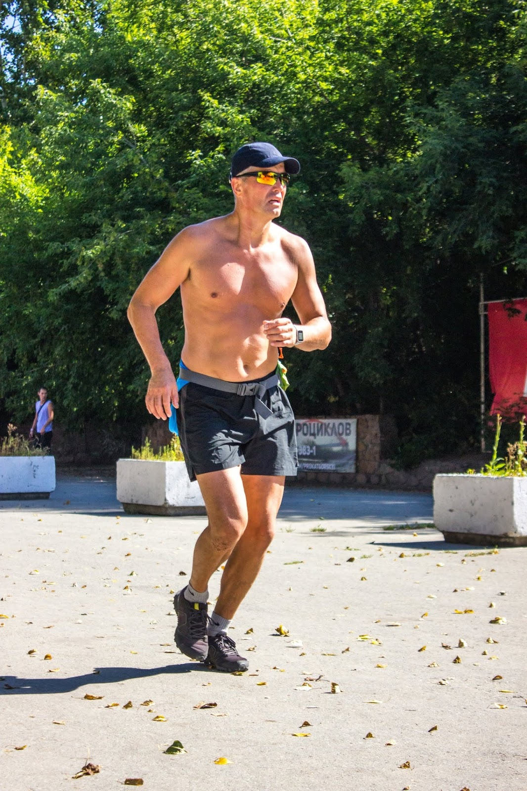

Но где же тогда 3-ий? Искать было некогда. С одной стороны, перспектива занять призовое место только что практически растворилась, это огорчало; с другой — теперь не за кем и незачем гнаться, а значит, можно просто бежать в свое удовольствие, это радовало. Здесь подъем сменился спуском, я стал на нем постепенно ускоряться, прищурил глаза от солнца и уже начал предвкушать скорый финиш и отдых, как вдруг почувствовал знакомые биения в области стоп… Не готов процитировать здесь те слова, которые я мысленно выкрикивал в тот момент в адрес самого себя и своих шнурков. Вскоре замаячила Баня №1, а от нее сразу начался финишный разгон. Я пересек заветную линию под скромные аплодисменты судей и их ассистентов (других людей там почти не было).

Меня поздравили с финишем и вручили красивую деревянную медальку финишера. Я был слегка не в себе от происходящего, поэтому даже не стал пытаться выяснить, каким по счету прибежал. Вместо этого пришлось идти переодеваться в баню, так как стоять в мокрой одежде было откровенно холодно. Уже выходя из переодевалки и все еще подергиваясь от холода, я заметил, что в парилке сидят люди, и вспомнил, что в анонсе старта всем финишерам обещалась баня. Зашел туда, уселся на горячую дощечку, расправил плечи, сделал глубокий вдох и понял — вот такая организация соревнования по мне гораздо лучше помпезных мероприятий с изысканными фан-зонами и электронным хронометражем. Но это оказалось еще не все. Специально приглашенный на этот старт дядечка во дворе бани устроил настоящую кухню: приготовил в котле суп на открытом огне, настрогал овощного салата, заварил огромную кастрюлю чая.

Сидя на деревянной лавке на свежем воздухе после такого старта и баньки, только что приготовленный горячий супчик воспринимался божественным. На столе лежали какие-то информационные буклетики, придавленные от ветра синей плавательной калабашкой. Разглядывая эти бумажки во время еды, я несколько раз аккуратно перекладывал калабашку с места на место, пока мне не сказали, что я не обязан держать ее на столе и могу убрать к себе в сумку. И без того подтупливавший мозг заклинило окончательно: с какой стати я должен убирать к себе чью-то калабашку? Оказалось, что это была моя потеряшка; отдыхавшие на первом пруду ребятишки заметили ее, подобрали и принесли организаторам в баню. Видимо, они не знали, что она стоит почти 500 р. Пока я предавался всем этим радостям жизни, к финишу пришли все участники, судьи подвели итоги соревнования и организаторы объявили о начале церемонии награждения. К одному из заборов двора был вынесен пьедестал — три обрезка здоровенных пней разной высоты. Когда дело дошло до награждения в моём зачете (“9 км лично”), на пенек 3-го места был приглашен тот самый мужчина в тюменской футболке, который обогнал меня после неверного поворота на стройку, а затем отстал в Блюдце. “Так вот кто меня обошел!” — подумал я, — “Но когда он успел-то?” Ведущий церемонии Евгений тем временем объявил о награждении за 2-ое место и… назвал мое имя. В последний раз я чувствовал что-то подобное еще в школе, когда совершенно внезапно для себя победил в районной олимпиаде по физике. Мне вручили грамоту, пакетик с раздаткой, а главное — еще одну деревянную медальку, на сей раз с красивой цифрой 2. А первое место досталось другому парню, опытному участнику этой гонки.

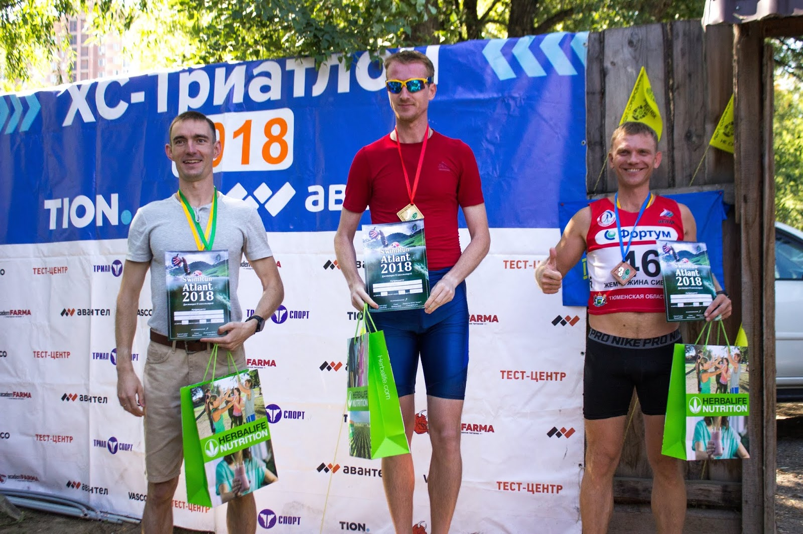

По ходу церемонии я разобрался в путанице призовых мест. Для той женщины-волонтера я действительно был 4-ым по счету бегуном, миновавшим ее. Но она понятия не имела, в каком зачете я бегу, равно как не знала этого и об остальных участниках. На самом деле, мимо нее на тот момент пробежала одна пара бегунов в командном зачете и всего один участник в личном (тот самый опытный парень); следовательно, я уже тогда был 2-ым в своем зачете. Судя по моему отставанию от лидера (5 с лишним минут), мне можно было не упираться на том последнем участке в попытках догнать “проходимца”. И все же я ничуть не пожалел об этом. Равно как и об участии в этом старте в целом. Он здорово пополнил мою копилку соревновательного опыта и подарил массу позитивных впечатлений, каких не добудешь в повседневной жизни. Думаю, такого запаса должно хватить, чтобы мне повторно решиться на такой старт в будущем году. А быть может, и не только мне:wink:

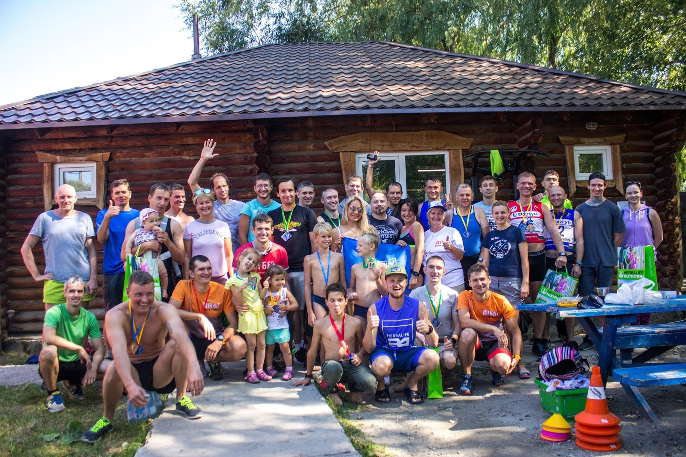

&nbsp;

<iframe height='405' width='590' frameborder='0' allowtransparency='true' scrolling='no' src='https://www.strava.com/activities/1779549590/embed/6b4ed2f9f33a601c20efcfca29962b464a375ea5'></iframe>

© Фотографии: [автор](/about), [Анна Поливаха](https://vk.com/id214307380), [Анастасия Пешкова](https://vk.com/id80370465)