Это заметка не о прошедшем соревновании, а о подготовке к будущему. Точнее, об одном этапе – отпуске. Летом 2018 и 2019 годов я отдыхал в Горном Алтае и в промежутках между типичными занятиями туриста-булки намотал &approx;150 км бегом по живописным местам Чемальского района. За это время сделал несколько интересных и важных наблюдений, которыми хочу поделиться с тобой.

## Вместо вводной

Рискую тебя удивить, но в районе Чемала для нас, бегунов, никто ничего специально не делал: дорожки не проложены, дистанции не размечены, пунктов питания нет (не считая общественных:wink:) Хуже того, некоторые места могут оказаться не только малоприятны для бега, но и опасны. И чтобы поменьше возвращаться к этому вопросу впредь, я хочу сразу выписать небольшое…

##### :grey_exclamation: Предостережение

Если обычно ты бегаешь по зальной дорожке, стадиону или иной прелести цивилизации, то выходить сразу на горно-алтайскую пересеченную местность и **бежать, куда глаза глядят, не стоит**, потому что можно наткнуться на:

* каменистые автомобильные дороги (щебень и мелкие камни летят от колес как пули)
* скользкие тропинки (летом на Алтае трава мокреет не только утром, но и вечером)
* скот на выпасе (не всегда дружелюбная парнокопытная фауна гуляет повсюду)
* подвесные мосты (раскачать которые можно даже пешком, не говоря уж о беге)

И даже если опасности нет, впечатление от пробежки могут подпортить вот такие местные “достопримечательности”:

* нагруженные участки дорог (с шумом, дымом, грязью и т.п.)
* резкие подъемы и спуски (все-таки Алтай несколько Горный)
* колючие и липучие растения (в изобилии на любой непротоптанной дороге)
* мины животного происхождения (не буду объяснять, загугли)
* редкость мостов через реку (между шансами попасть на тот берег обычно лежат километры пути)

Надеюсь, к этому моменту я распугал всех, кто думал, что Алтай буквально создан для пробежек. А если ты всё ещё читаешь, то теперь, оставив ужасы позади, мы можем поговорить…

#### :sunny: О хорошем

Помимо красивых пейзажей, Алтай славен своим чистым богатым воздухом, что немаловажно для занятий бегом. Некоторые из моих знакомых, бывавших там, отмечали необыкновенно быстрое восстановление после тренировок и связывали это в том числе с воздухом. Кроме того, благодаря безлюдности большинства беговых дистанций, пробежки по просторам Алтая несут абсолютно нехарактерные для города чувства: чувство полного отрешения от суетливой диффузии людей и машин, чувство гармоничного приобщения к естественной природе и, конечно, чувство свободы, свободы от стен, заборов, светофоров, а зачастую и от дорог... К слову, последнее зависит от выбранного места пробежки, поэтому расскажу о таких местах поподробнее, а заодно поделюсь сделанными там снимками (кликай по ним для просмотра “в полный рост”).

## Село Чемал

И хотя по местным меркам Чемал – довольно крупный населенный пункт, сам по себе он не представляет особого интереса для пробежек, так как является, по сути, обычным селом, хоть и большим. Это значит, что асфальтных дорог в нем не так уж много, а большинство остальных – это пыльные проселочные улочки, где не только не на что смотреть, но и самому легко стать достопримечательностью для местных.

#### Окрестности Бешпека

Зато в этом селе, рядом со стечением двух рек (Чемала и Катуни) есть небольшая [гора Бешпек](https://beta.2gis.ru/gornoaltaysk/geo/3800599380361398/86.004757%2C51.394379?m=86.012541%2C51.397471%2F15.5), в районе которой можно побегать.

[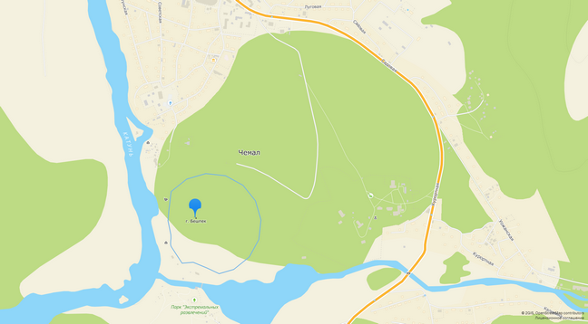](images/large/гора-бешпек-на-карте.png)

Эти окрестности представляют собой рельефную лесостепь со множеством тропинок и парочкой  приличных дорог.

[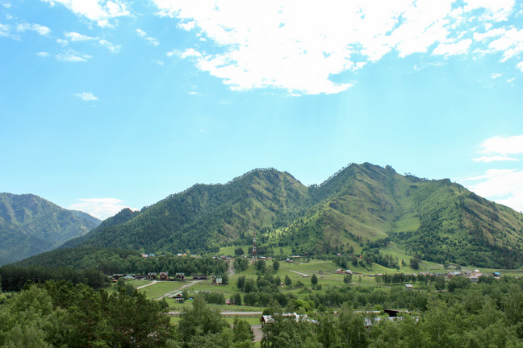](images/large/гора-бешпек-фото.jpg)

Сам я был там лишь в роли гуляющего туриста, однако отметил для себя это место как потенциальный беговой участок. А бегал в те дни я в других местах.

#### (за)Чемальский тракт

Одно из таких мест – выезд из Чемала, вдоль одноименного тракта. Вообще, бежать вдоль этой дороги, равно как и вдоль любого другого тракта, – так себе идея: много машин, твердое покрытие, отсутствие тени…

[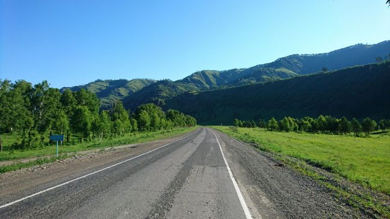](images/large/асфальт-за-чемалом.jpg)

Однако если выбежать ранним утром и именно за Чемал, то машин почти нет, солнце еще не жжет, а тень могут обеспечивать близлежащие горы. На втором-третьем километрах начинают открываться дивные виды на Катунь.

[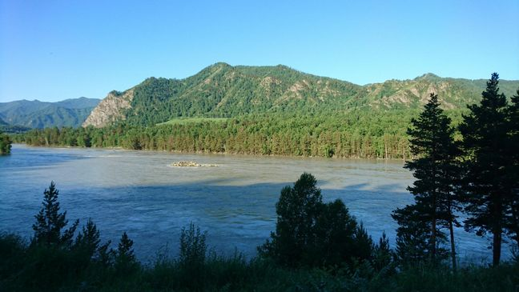](images/large/катунь-за-чемалом.jpg)

Однако подбежать к ней для освежения удастся едва ли, так как трасса проходит в отдалении от реки. Помимо этого, не стоит планировать длинную пробежку в ту сторону ещё и потому, что на этом направлении практически нет тени, и как только солнце поднимется над близлежащими горами, скрыться от него будет негде. Словом, это направление – вариант для одноразовой, частично экстремальной пробежки. Пример трека с фотографиями [здесь](https://www.strava.com/activities/1647502998).

#### Дорога вдоль реки Чемал

Куда более “мягким” будет вариант пробежки вдоль небольшой речки Чемал. Путь к ней начинается на ответвлении от Чемальского тракта, где стоит весьма оригинальное этно-кафе “[Юрта](https://beta.2gis.ru/gornoaltaysk/firm/70000001024118477/86.023417%2C51.397918?m=86.023676%2C51.397677%2F17.9)”.

[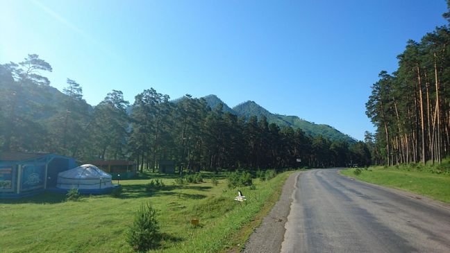](images/large/юрта-на-развилке.jpg)

Однако сама речка станет видна лишь спустя около километра. Зато совсем скоро к ней можно будет подбежать вплотную и взбодрить себя её леденяще-свежей водой. Это направление тоже закатано в асфальт, но нагружено машинами значительно меньше, и пейзажи не дают убрать камеру в карман.

[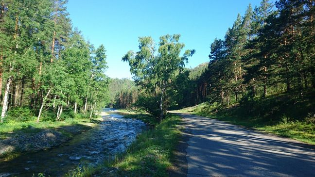](images/large/река-чемал-у-дороги.jpg)

Перепады высот есть, но не большие: за 10 км у меня накопился подъем в 170 м. В отличие от Чемальского тракта, почти вся эта трасса проходит вдоль деревьев, поэтому даже днем там не так уж жарко, не говоря уж об утре и вечере, когда на нее наползает тень гор… Словом, сюда можно бегать и в качестве утренней зарядки, и для основной тренировки. Пример трека с фотографиями [тут](https://www.strava.com/activities/1651959302).

## Село Узнезя

Это небольшое село расположено в &approx;12км не доезжая Чемала (со стороны Горно-Алтайска). Оно растянуто вдоль правого берега Катуни (если смотреть по ходу ее течения) и обрамляет собою место слияния одноименной речки с Катунью. Как и большинство сёл вдоль Чемальского тракта, Узнезя не очень подходит для пробежек по своим улицам (почему – см. выше про Чемал). Зато в непосредственной близости от него есть вполне подходящие места, о них расскажу чуть подробнее.

#### Дорога на Бешпельтир (к “Большим котам”)

Это направление начинается улицей [Береговой](https://beta.2gis.ru/gornoaltaysk/geo/3800650919971648/85.948384%2C51.525668?m=85.946581%2C51.526352%2F15.61), которая практически сразу запоминается приличным подъемом, а главное – каменистым асфальтом, вызывающем звук глухой пулеметной очереди по днищам проезжающих автомобилей.

[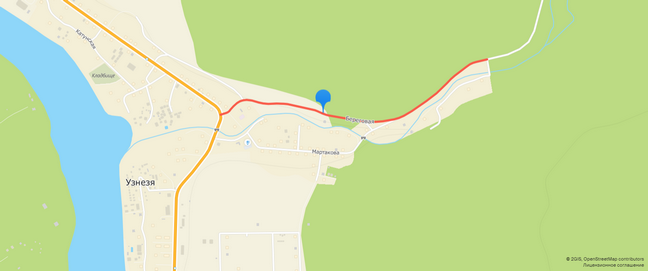](images/large/узнезя-улица-береговая.png)

Обочина вдоль дороги узкая, но сойти с нее вовсе зачастую нельзя: с одной стороны вплотную подступает лесистая гора, с другой – травянистый спуск к реке. Из-за этого бежать по этой дороге может быть опасно. К счастью, каменистое безобразие заканчивается примерно через 3 км и сменяется гладким, относительно мягким асфальтом и нормальной обочиной. Если бежать там утром, то частота встречи автомобилей сильно снижается; например, во время моей пробежки в 7:00-8:00 их было по одному раз в &approx;15 минут. Кстати, на этом направлении у машин есть вполне конкретное расписание – оно определяется режимом работы Центра ездового собаководства под внезапным названием “[Большие коты](https://beta.2gis.ru/gornoaltaysk/firm/70000001023313586/tab/contacts)” (в 13 км от Узнези). Летом 2019 года он был открыт каждый день с 12:00 до 20:00, и туда охотно ездили люди. Так зачем же там бегать, если всё так сложно? Причин, как минимум, две.

Во-первых, это весьма живописная дорога.

[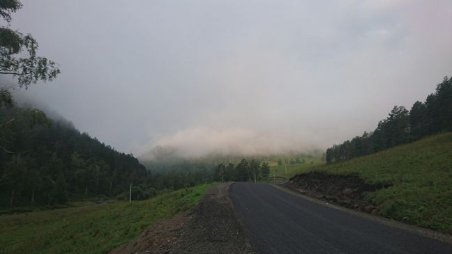](images/large/дорога-на-бешпельтир.jpg)

Она проходит меж гор, постоянно окаймляя собою одну за другой и этим напоминая серпантин. Ее края отнюдь не симметричны: один, как правило, резко уходит вверх, другой – скатывается вниз к речке Узнезя, которая то и дело виляет по этому ущелью, как бы заигрывая с серпантином.

[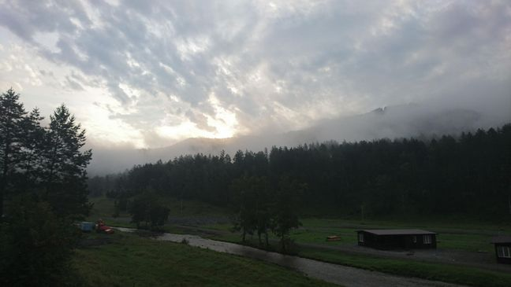](images/large/река-узнезя.jpg)

Во-вторых, это отличный участок для рельефного забега. Перепады высот там небольшие, зато их много и они довольно разнообразны. За 5 км пути в этом направлении у меня набралось &approx;150 м подъема.

Словом, сюда можно сбегать в спокойное от машин время, чтобы полюбоваться алтайскими красотами и потренировать подъемы/спуски. Пример трека с фотографиями [прилагаю](https://www.strava.com/activities/2625323544).

#### Дорога на Куюм (в “Сад пионов”)

На первый взгляд, это направление очень похоже на предыдущее: также ответвляется от Чемальского тракта рядом с Узнезей, также пролегает вдоль маленького притока Катуни, также изобилует небольшими перепадами высот.

[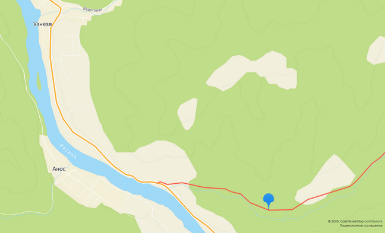](images/large/дорога-на-куюм-на-карте.png)

Однако в отличие от соседа, этой дороге не досталось асфальта, и она осталась просёлочной. С одной стороны, это плохо: в сухую погоду она изрядно пылит, в дождливую – хлюпает.

[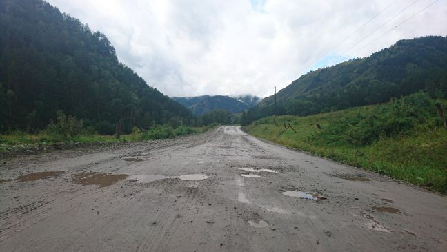](images/large/дорога-на-куюм-в-дождь.jpg)

С другой стороны (и это хорошо), на ней нет  стольких камней, чтобы они непрерывной очередью вылетали из-под колес проезжающих автомобилей. Кстати, поток последних обеспечивается, в основном, часами работы “[Сада пионов](https://beta.2gis.ru/gornoaltaysk/firm/3800440466605820/tab/contacts)” – красивейшего и весьма уютного питомника растений и животных, расположенного в 2,5 км от съезда с Чемальского тракта. Ещё через 500 м от этого дивного места находится “[Форт Куюм](https://beta.2gis.ru/gornoaltaysk/firm/70000001037660230/tab/contacts)” – база отдыха и музей в виде старинной деревянной крепости; туда тоже курсируют автомобили. К счастью, их не так уж много, а после Форта дорога и вовсе остается почти пустой и открывает взгляду беспрерывный поток великолепных пейзажей, которые даже в пасмурную погоду выглядят живописными.

[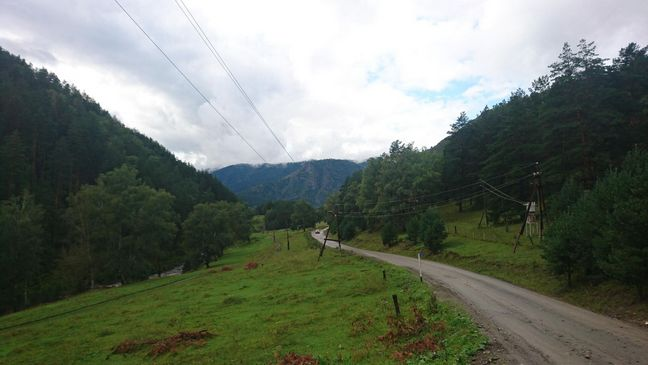](images/large/спуск-из-куюма.jpg)

Путь пролегает вдоль небольшой речки Куюм и местами сходится с ней настолько близко, что можно легко подойти прямо к воде. Делать этого, однако, мне не хотелось, так как в отличие от бирюзовой Катуни самобытный Куюм почему-то имеет темно-бурый цвет воды (по крайнем мере, в августе).

[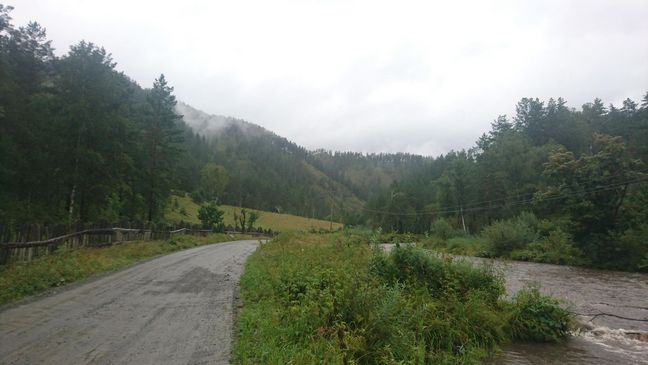](images/large/пейзаж-по-пути-в-куюм.jpg)

Приятной “фишкой” этого направления пробежки является небольшой [родник](https://beta.2gis.ru/gornoaltaysk/geo/70030076164753391/tab/info), расположенный прямо на съезде с Чемальского тракта, напротив медовой ярмарки “Пчёлка”. Из этого места, кстати, открывается неплохой вид на Катунь и только что покинутый тракт.

[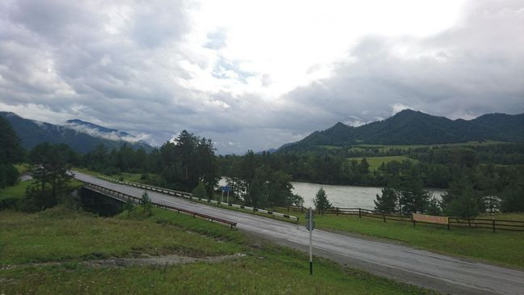](images/large/катунь-и-чемальский-тракт.jpg)

На роднике можно освежиться и утолить жажду до/после забега по пересеченному безобразию куюмской дистанции. Это может быть особенно приятно, если ты прибежишь сюда со стороны Узнези, потому что ближайшие 500 м в сторону села придется (или только что пришлось) бежать по очень узкой обочине кочегаристого Чемальского тракта.

Как и его предшественник, это направление хорошо подходит для утренних рельефных пробежек, когда хочется и потренироваться на нетривиальной трассе, и погулять по живописным просторам Горного Алтая. Пример трека с фотографиями [прилагается](https://www.strava.com/activities/2643411308).

Может показаться, что пробежки в этом районе – это всегда компромисс: либо бежать по ровному асфальту, но тогда дышать дымом пролетающих авто и слушать их шум, либо уединиться среди красивых пейзажей, но тогда бежать по бездорожью, косогорам и прочему. Если ты тоже так думаешь, знай – это лишь потому, что… это правда. Обычно. Но есть приятные исключения, читай дальше.

#### Узнезинское плато (у “Лохматой фермы”)

Неподалеку от выезда из Узнези в сторону Чемала есть поворот к местному подобию зоопарка – “[Лохматой ферме](https://beta.2gis.ru/gornoaltaysk/geo/70030076138413038/tab/info)” (a.k.a “Zoo-рай”). Вскоре после поворота дорога резко уходит в подъем метров на 15-20, а там снова выравнивается и простирается на 400 м через большое, практически плоское поле. Вот там-то как раз и можно спокойно побегать без машин и подъемов.

[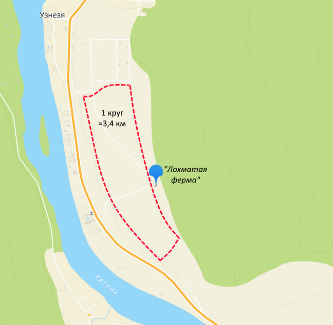](images/large/узнезинское-плато-на-карте.png)

Для себя я назвал это место “Узнезинское плато”, потому что оно (1) плоское, (2) расположено на высоте и (3) имеет довольно четкие границы. С запада (слева, если смотреть по карте) оно ограничено поросшим деревьями резким спуском к Чемальскому тракту, с востока – таким же лесистым подъемом в гору, с севера – домами жителей Узнези, а с юга – земляной насыпью перед небольшим заводом (или фабрикой). При этом деревьев на нем самом почти нет, а те, что есть – совсем небольшие, благодаря чему из любой точки открывается чудный вид на окружающее великолепие Алтая.

[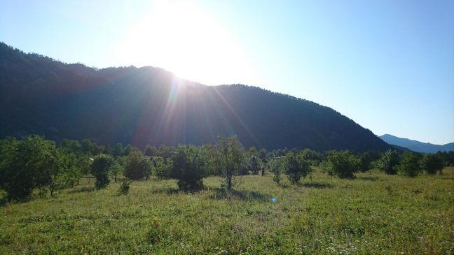](images/large/деревья-на-плато.jpg)

Правда, в этом есть и минус – в дневное время там практически нет тени, и спрятаться от солнца будет негде.

[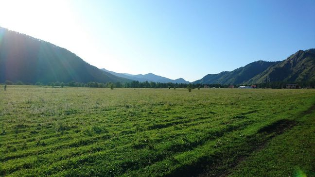](images/large/солнце-на-плато.jpg)

В связи с этим, бегать там лучше утром или ближе к вечеру, но только помни, что из-за близости гор солнце скрывается там весьма рано, а без него горный воздух стремительно остывает.

[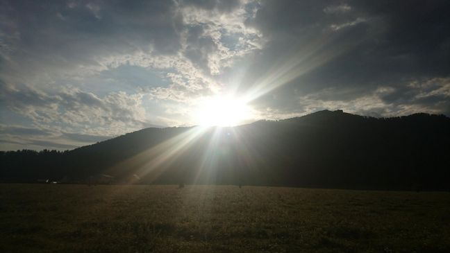](images/large/восход-над-плато.jpg)

Несмотря на то, что контур плато на карте кажется довольно четким, оббежать его по периметру не так уж просто, поскольку дороги и тропинки для этого есть далеко не везде. Можно, конечно, закрыть глаза на эти предрассудки и рвануть напрямик по траве, но тогда надо быть готовым, к тому что (1)  кроссовки и носки покроются плотным слоем колючек, (2) голени (если они не прикрыты) будут поцарапаны жесткой высокой травой и (3) ступни могут подворачиваться на многочисленных неровностях чистого русского поля. Чтобы всего этого избежать, лучше придерживаться тропинок, а для этого их нужно тщательно высматривать среди травы.

[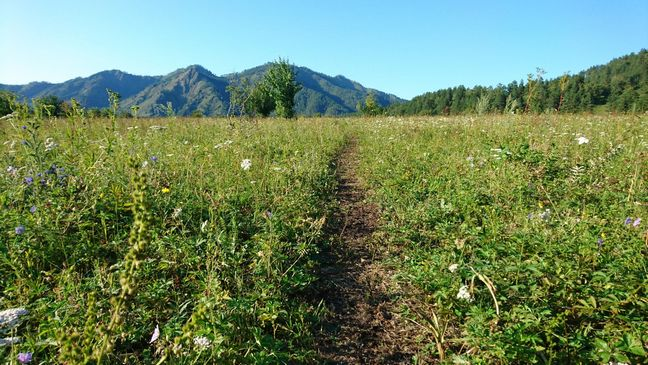](images/large/тропинка-на-плато.jpg)

Пример трека с точным следованием дорогам и тропинкам по периметру плато можно найти [здесь](https://www.strava.com/activities/2640904459).

Помимо “Лохматой фермы” на плато расположилась крохотная и с виду довольно аскетичная усадьба “[Аксай](https://beta.2gis.ru/gornoaltaysk/firm/70000001006810635/tab/contacts)”. Она находится прямо на въезде на плато и из-за этого преграждает собою путь вдоль западной (левой по карте) границы плато, приходится ее огибать. Сделать это с северной стороны весьма не просто: нужно вовремя заметить ту самую тропинку, которая позволит не бежать вдоль забора Аксая, чертыхаясь на каждой кочке и собирая на себя колючки. Мне потребовалось 3 попытки, чтобы научиться ее находить. К счастью, есть более простая альтернатива – при развороте у жилых домов (в северо-западной части плато) вместо тропинки можно выбежать сразу на широкую проселочную дорогу (которая, если верить 2ГИС, именуется улицей [Звездной](https://beta.2gis.ru/gornoaltaysk/geo/70030076165726516/85.94831%2C51.512472?m=85.947907%2C51.51153%2F17.96)).

[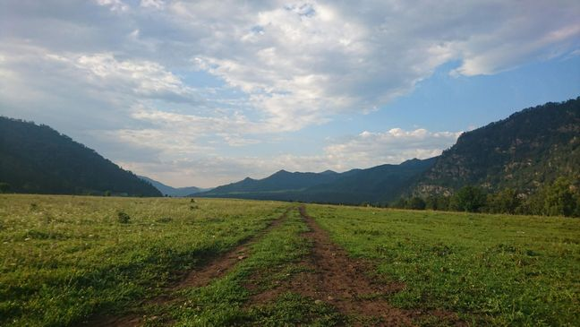](images/large/улица-звездная.jpg)

Такой вариант заметно сократит длину круга, зато убережет от снижения доли позитивных эмоций.

Еще одной местной “достопримечательностью”, которую тоже лучше огибать, является местная парнокопытная фауна: небольшие стада коров и лошадей можно встретить почти в любое время суток в самых разных точках плато. От них, как правило, не исходит никакой агрессии или вреда, чего не скажешь о южном соседе плато – небольшом заводике по производству или переработке непонятно чего. За две недели моего пребывания в тех краях он работал всего один день, однако дымил и вонял так, что даже приближаться не хотелось. Активность его видна издалека по дыму, поэтому еще до подъема на плато можно решить: стоит там сейчас бегать или нет.

В целом, “Узнезинское плато” хорошо подходит для ровных, лёгких (например, аэробных) пробежек в утренние или вечерние часы. Оно сочетает в себе плоский рельеф с отсутствием автомобильного трафика. Примеры треков с фотографиями (и без) имеются: [вот](https://www.strava.com/activities/2621256499), [вот](https://www.strava.com/activities/2615205726), [вот](https://www.strava.com/activities/2612313209) и [вот](https://www.strava.com/activities/2640904459).

Но что делать, если всё же хочется спокойно пробежаться по нормальной дороге с твердым покрытием, полюбоваться видами Алтая, но при этом не закоптиться, как походный чайник, и не упахаться в преодолении бесконечных подъемов? К счастью, место для такой пробежки в Чемальском районе тоже есть.

#### Трасса Аскат-Аюла

Эта трасса проходит по левому (относительно течения) берегу Катуни, где нет Чемальского тракта, мало баз отдыха, а сёла очень маленькие. Всё это формирует один из главных плюсов дороги: на ней очень мало машин (а по сравнению с трактом их там просто нет).

[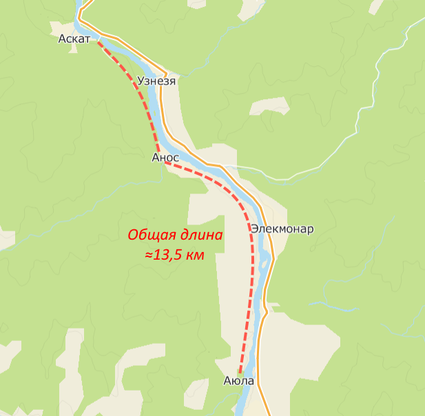](images/large/трасса-аскат-аюла.png)

При этом трасса уложена хорошим асфальтом (даже по меркам автомобилиста) и имеет приличную обочину, хоть и не везде.

[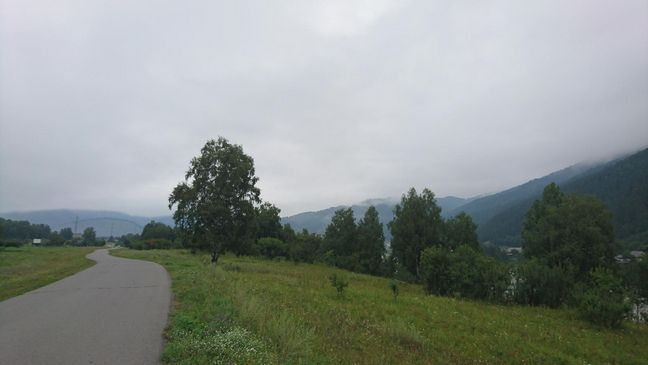](images/large/дорога-за-катунью.jpg)

Это довольно протяженная дистанция (свыше 13 км), но считать ее из-за этого тупиковой не стоит, так как примерно на 1/3 длины, в районе села Анос, у нее есть перемычка – старенький подвесной мост для пешеходов. По нему можно легко добраться из Узнеси в Анос и обратно, только важно помнить: бегать по такому мосту нельзя, он легко раскачивается.

[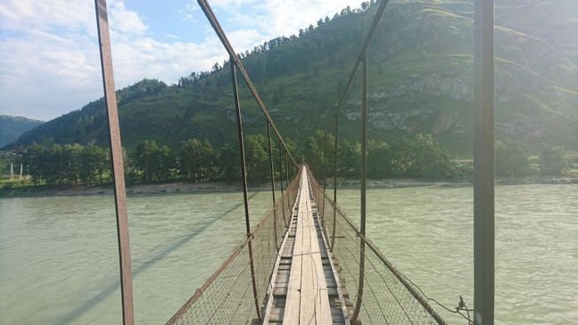](images/large/начало-подвесного-моста.jpg)

Решив объединить известные мне поблизости мосты, я составил беговой маршрут под названием “[Узнезинский круг](https://www.strava.com/routes/21004996)”. Получился замкнутый контур длиной &approx;11 км, пересекающий Катунь по этому подвесному мосту, а также по автомобильному мосту у села Аскат. И хотя маршрут выглядел удачным на карте, [бежать](https://www.strava.com/activities/2617155689) по нему мне не очень понравилось, потому что заметная его часть проходила по Чемальскому тракту со всеми его “прелестями”. Зато левобережная часть, напротив, приятно запомнилась участком трассы Аскат-Аюла.

На своём протяжении эта трасса сменяет несколько пейзажей. На отрезке между Аскатом и Аносом она вплотную подступает к скалистым горам, из-за которых вечером довольно скоро начинает покрываться тенью.

[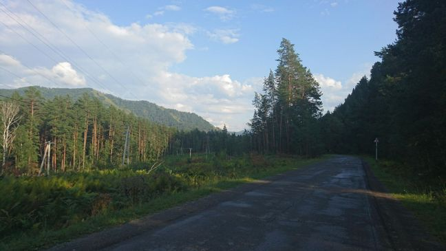](images/large/тень-на-левом-берегу.jpg)

Реку на этом отрезке практически не видно из-за густой хвойной полосы на самом ее берегу. К тому же, местами трасса сильно отдаляется от реки, что, впрочем, не делает пейзажи менее захватывающими.

А на более протяженном отрезке (Анос-Аюла) река становится чуть ближе, но все же не настолько, чтобы можно было легко к ней подойти. Тем не менее, ее становится видно, причем, не столько за счет более редких деревьев, сколько за счет перепада высот: на этом отрезке трасса зачастую возвышается над рекой, что открывает поистине завораживающий вид.

[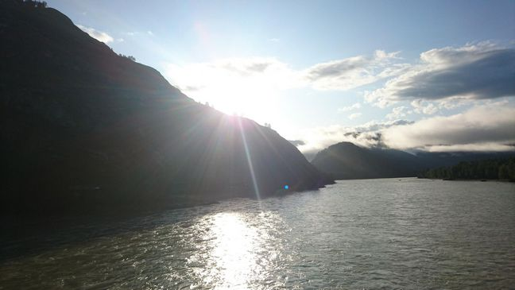](images/large/восход-над-катунью.jpg)

Несмотря на такие перепады высот, резких и/или затяжных подъемов на этой трассе практически нет; ее можно считать почти плоской.

По другую сторону этого отрезка уже нет гор поблизости. Они виднеются чуть поодаль, а перед ними простирается широкая равнина.

[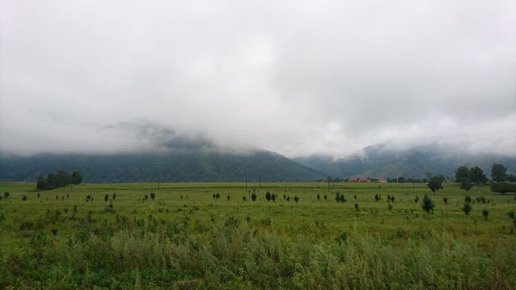](images/large/равнина-на-левом-берегу.jpg)

После того, как пробежишь участок вдоль подножья гор, бежать вдоль равнины весьма необычно: за счет отдаленности большинства её видимых объектов кажется, что не ты бежишь вдоль неё, а она мееедленно проплывает мимо тебя словно гигантский панорамный снимок.

Конечно же, самые яркие впечатления остаются от встречи с рекой. Непоколебимая мощь Катуни, сочетаясь с мерным и совсем негромким ее течением, создает ощущение одновременной власти и покорности этой природной стихии перед человеком. А наблюдение за ней может и вовсе может поглотить любого на долгое время. К счастью, на пробежках это не так опасно, но пробежать мимо и не сфотографировать все же не получается.

В районе автомобильного моста у села Аскат берег*а* Катуни напоминают фрагмент лабиринта.

[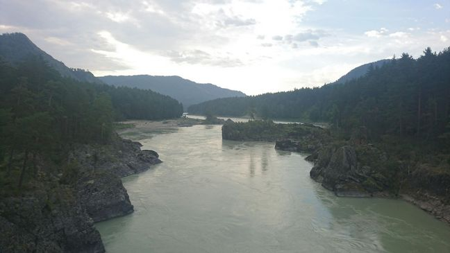](images/large/катунь-у-аската.jpg)

Зато между Аносом и Узнезей, в районе подвесного моста, напротив – она простирается широким фронтом, эффектно “обруливая” поросший деревьями берег.

[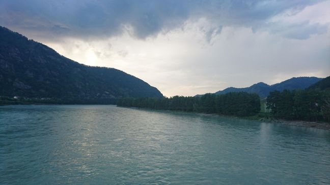](images/large/поворот-катуни.jpg)

Наверно, это даже хорошо, что по подвесному мосту нельзя бегать, ведь благодаря этому можно неспеша насладиться видами Катуни, почувствовать себя на волоске (точнее, на тросе) от ее холодных вод и понаблюдать, как она, едва миновав мост, снова увиливает, на этот раз от горы.

[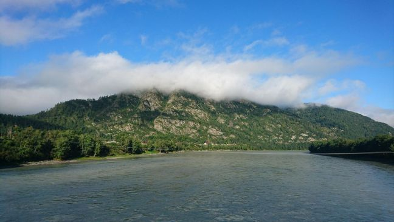](images/large/катунь-после-подвесного-моста.jpg)

Как нетрудно догадаться, это беговое направление должно хорошо подойти для длительных тренировок с предсказуемым рельефом. В то же время, благодаря великолепным видам, там будет приятно провести и легкую короткую пробежку. Примеры треков с фотографиями можно найти здесь: [вот](https://www.strava.com/activities/2617155689), [вот](https://www.strava.com/activities/2628310757), [вот](https://www.strava.com/activities/2637099823) и [вот](https://www.strava.com/activities/2623772495).

## Вместо заключения

Едва ли мою заметку можно считать хоть сколько-нибудь обстоятельным обзором всех беговых маршрутов Чемальского района, ведь их там несравнимо больше. Тем не менее, я надеюсь, что ты вспомнишь о ней, когда будешь собираться в следующую поездку на Алтай и, укладывая вещи, на мгновение застынешь с мыслью: “А не взять ли беговые кроссовки?”  
Теперь ты знаешь ответ:wink:

Приятного отды[ха!](images/large/отдыхай-правильно.jpg)

&nbsp;

#### *P.S.*

Летом 2019 г. тренировки на Алтае стали для меня основным этапом подготовки к полумарафону им. А. Раевича – большому новосибирскому старту, где я намеревался обновить [личный рекорд](/articles/2019/one-run/) на этой дистанции. Мне удалось достичь этой цели, [выбежать](/competitions/#raevich-2019) за психологическую отметку в 1:30:00, и я уверен, что существенная часть этого успеха была заложена там – на живописных маршрутах Чемальского района в Горном Алтае:mountain:
