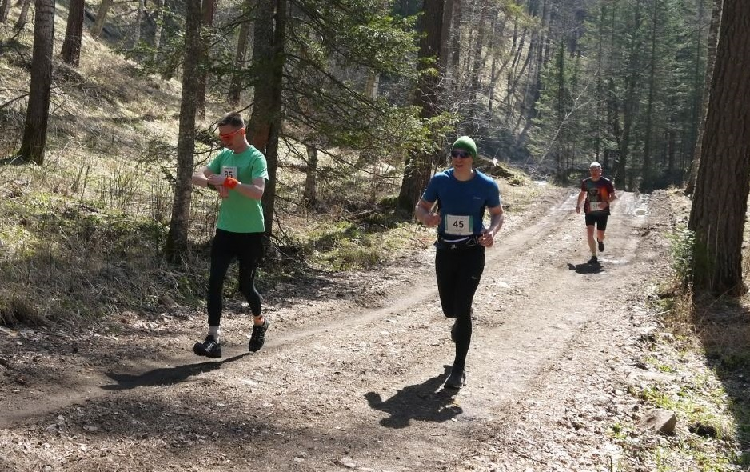

Пробежав 11 км по рыхлому насту Обского моря на “Белом Трейле” в марте, я понял, что у организаторов серии забегов “Taiga Trail” легких дистанций не бывает. Однако перспектива провести первую часть майских праздников в Белокурихе, да еще и совместить отдых с забегом по живописной пересеченной местности, показалась настолько заманчивой, что я решился и взял слот на среднюю дистанцию (17 км) на второй забег этой серии – “Майский Трейл”.

Сигнальный выстрел на старт был дан 5 мая ровно в 10 утра. Чуть более 120 спортсменов, среди которых были мои друзья-коллеги [Андрей Сердцев](https://www.strava.com/athletes/4409708), [Тимур Мазитов](https://www.strava.com/athletes/24745670) и Илья Грачев, отправились в путь с территории санатория Россия по лесной дороге, которая весьма символично сразу уходила вверх.

Я долго обнимался со своими болельщицами (женой и дочкой), поэтому оказался чуть ли не в хвосте толпы, зато успел вдоволь насмотреться на других участников забега, пока прорывался вперед. Коль скоро сам я был полным нулём в трейловых забегах и готовился практически наугад, для меня стало удивительным, что большинство других людей оказались подготовлены весьма продуманно: помимо трейловых кроссовок (в основном, Salomon) на них были беговые штаны, защищавшие их от прямой посадки клещей и от многочисленных веток и кустов (сам я до последнего собирался бежать в шортах). Кроме того, многие были экипированы различными подсумками с питанием и даже палками и перчатками для упрощения восхождения в особо крутые подъемы. На их фоне я чувствовал себя несколько неуверенно, но мысль, что это просто первый, пробный раз, и в случае чего я просто прогуляюсь пешочком по маршруту, меня успокаивала. Толпа бегунов относительно быстро растянулась, и уже спустя десяток минут начался первый серьезный подъем. Он резко сбил скорость общего продвижения, все перешли на шаг, так как не было смысла тратить силы на первом же подъеме. Я довольно долго шел в общем строю по узкой тропинке, однако со временем осознал, что такой темп мне не комфортен и что даже пешком я могу продвигаться быстрее. Я вышел на траву и, имитируя руками движение палками (чтобы помогать себе всем телом), стал подниматься вперед, периодически обходя других бегунов. И хотя сердце от такого подъема стало слышно где-то в глотке, особого дискомфорта это не доставляло, а после небольшой передышки пешим ходом на вершине, я смог продолжить бег. 

Обойдя еще несколько бегунов по ровным тропинкам на вершине, я уже начал думать, что этот трейл не такой уж и сложный, но вскоре начался симметричный спуск, и на нем меня ждал неприятный сюрприз – те, кого я обходил на подъеме, теперь легко опережали меня на этом затяжном спуске! Но самое неприятное было в том, что я практически ничего не мог с этим сделать: пытаясь ускоряться, я чувствовал, что либо теряю устойчивость и рискую подвернуть ногу, либо приземляюсь настолько твердо, что каждый шаг отзывается ударом в коленях. Я пытался вилять по спуску, но это тоже ничего не дало: я лишь мешал другим и не ускорялся сам. За один только этот спуск я потерял больше 5 позиций и подустал не меньше, чем на подъеме. К счастью, первая половина дистанции почти целиком состояла из подъемов, и я воспользовался этим, чтобы не только наверстать позиции, но и еще продвинуться вперед. 

На 6-ом километре, после первой части самого большого подъема нас ждал первый пункт питания – там я влил в себя пол-стаканчика изотоника, запихал в рот банан и ухватил четвертинку апельсина в расчёте на то, что неспеша зажую всё это на ближайшей ровной тропинке. Но просчитался – вместо тропинки меня сразу же ждала вторая часть подъема, еще более крутая и жесткая, чем первая, поэтому жевать все это пришлось в темпе и как попало. Тем не менее, заправка выдалась на славу! На этом подъеме мне встретились два мальчика лет восьми. Они отошли с тропинки, чтобы уступить дорогу, и с глубоким восхищением наблюдали за бегунами, которые в их глазах, вероятно, выглядели космическими супергероями: в экипировке, в очках, кто-то с палками, бегут, пыхтят… Мальчишкам захотелось как-то поучаствовать в этом завораживающем действе, и один из них решил подбодрить меня, выдав: “Земля вам пухом!” Так меня еще не поддерживали… Безумный подъем закончился, я оказался на вершине горы Круглая (801 м) и продолжил свой путь по огромным каменным валунам. 

В паре мест из камней складывалась узенькая дорожка, своеобразный мостик, по обе стороны от которого простирались резкие обрывы высотой метров по 80. Смотреть туда не хотелось; взгляд больше отвлекался на безумной красоты пейзажи, открывавшиеся со всех сторон вдали. Однако на них смотреть тоже было некогда, ибо можно завершить гонку раньше и не в санатори… Парочка бегунов все же остановилась на одном из камней на селфи, чем я бессовестно воспользовался и обошел их, хотя раньше они были далеки. Спускаться с этой горы было тоже весьма не просто: приходилось много прыгать по камням, а потом и вовсе бежать вдоль бокового склона по скользкой прошлогодней траве, еще спресованной недавним снегом. На этом участке я увлекся преследованием бежавшего впереди бегуна, а очнулся уже после этого спуска, когда бегун внезапно остановился – оказалось, что мы не знаем, куда дальше бежать. Он, в свою очередь, тоже ориентировался на впереди идущего, а тот потерял цепочку из меток трассы. Нас таких оказалось человек 5. Мы принялись рыскать по этому пятачку в поисках вешек (меток), но ничего не находили. Постепенно к нам стали приближаться те, кто был позади, и по их траектории мы поняли, что спускаться сюда не надо было, стоило повернуть намного раньше и обогнуть низ горы. Но теперь уже ничего не сделаешь, нужно было как-то продолжать гонку. Возвращаться на трассу напрямки оказалось хоть и короче, но сложнее – уж очень резкий подъем предстояло преодолеть (вернуть). Поэтому мы побежали по диагонали, снова под боковым углом к трассе через вообще никем не протоптанный и не размеченный участок. Вернуться к трассе удалось лишь когда она вышла на глинистую автомобильную дорогу и превратилась в серпантин, по которому предстояло завершить спуск с горы. Там я увидел как много народу уже успели убежать вперед и уступил еще несколько позиций, поскольку спуск по-прежнему давался мне плохо. Мысленно выругавшись и вспомнив подобный же опыт на “Белом Трейле”, я побежал вперед в комфортном для себя темпе. К счастью, спуск завершился относительно быстро и сменился живописной, относительно ровной дорогой вдоль маленькой речки. 

Это был 9-ый километр дистанции. Здесь я зажевал первый гель, восстановил дыхание и принялся потихоньку наверстывать упущенное. Вскоре догнал и своего напарника Тимура, с которым мы готовились к этому забегу накануне. Мы побежали в одном темпе до следующего пункта питания (где было только питье), а после него снова расстались – я ушел вперед на последнем большом подъеме в компании другого бегуна. Однако расставание было не долгим – как и следовало ожидать, большой подъем сменился большим спуском, и это снова вскрыло моё слабое место. Здесь не только Тимур ушел от меня в точку, но и долгое время дышавший мне в спину напарник-бегун. И если последнего я все же сумел нагнать и обойти на малюсеньких горках незадолго до финиша, то с Тимуром так не вышло – он уже 26 секунд отдыхал в санатории, когда я только прибежал на финиш. Оказалось, что перед нами было не так уж много финишеров: мое время 2:04:50 числилось в протоколе на 7-ом месте в абсолютном зачете (среди 123 бегунов). Пожалуй, пойдёт для первого раза.

Ни мозоль размером с большой палец, ни второй день нытья бедренных мышц не породили в моей голове мыслей, где сочетались бы слова "трейл" и "больше никогда". Но других поводов призадуматься осталось много: все-таки бег по гористой пересеченке очень сильно отличается от городского. Хотя бы тем, что это не только бег, но и ходьба. Как показал этот опыт, нужно тренировать не только подъемы, но и спуски, а экипировке уделять особое внимание, не полагаясь на свои предположения. Однако в любом случае возможности наслаждаться живописными видами никто не отменял, а значит, можно бежать/идти/гулять просто в свое удовольствие, так что рекомендую попробовать :wink:

<iframe height='405' width='590' frameborder='0' allowtransparency='true' scrolling='no' src='https://www.strava.com/activities/2342698150/embed/91b378c98e14b5e37e4710c81427eb17ff7c92a2'></iframe>