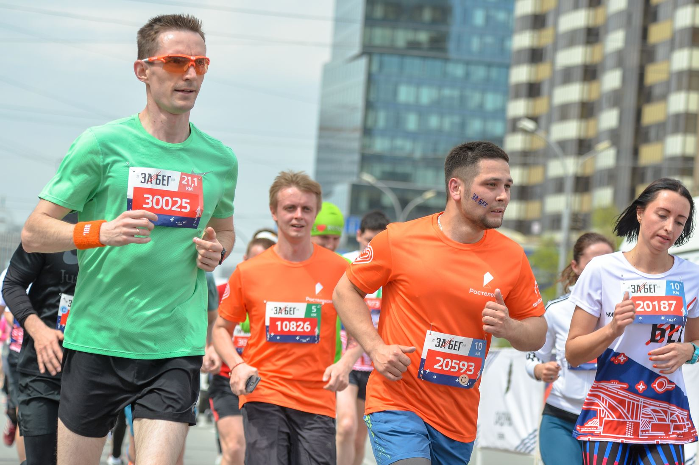

Говорят, самые страшные водители по числу ДТП – это даже не новички, а “псевдоопытные” – водители со стажем около 2-х лет. Ощущаемый ими уровень мастерства зачастую сильно выше реального, поэтому они выкидывают значок “начинающий” на помойку вместе со страхом ошибиться и начинают вытворять на дорогах то, чего новички себе не позволяют, а профессионалы если и делают, то правильно. Оказывается, такая заносчивость свойственна не только водителям, но и бегунам…

К своему третьему старту на [ЗаБег.РФ](http://забег.рф) я подходил, пожалуй, более осознанно, чем к другим половинкам. Первый полумарафон этой серии прошел в эйфории первого поцелуя (1:36:17), второй дался гораздо сложнее, но [результативнее](https://www.strava.com/activities/1583397255) (1:33:25), а от третьего на фоне предыдущих я ждал чего-то смешанного: и обновления личного рекорда, и легкости. Ощущение собственной формы в преддверии старта было оптимистичным настолько, что я встал в кластер А – самый быстрый кластер забега, где был пейсмейкер на 1 час 29 минут. (“Пейсмейкер” или просто “пейсер”– опытный бегун-ориентир с заявленным временем финиша). Там увидел много знакомых лиц, когда-либо потрясавших меня своими спортивными достижениями. Среди них и призер всероссийских соревнований по бегу Юрий Тарасов, и участники многодневного забега по Сахаре Михаил Козырь и Виктор Красноусов, и успешный финишер экстремального норвежского триатлона NorseMan Сергей Головин. У меня не было цели всерьез тягаться с ними, но сам факт оказаться с ними в одной стартовой группе изрядно добавлял мандража. Впрочем, даже объективно мне было здесь место, ведь следующий кластер В имел пейсмейкера только на 1:34, а это даже медленнее моего прошлого результата.

Когда, наконец, раздался запоздавший выстрел на старт, я устремился вперед в составе какой-то неопределившейся толпы: одни неистово рвали вперед, другие следовали им, но тут же отставали даже на фоне меня. Из-за этого контролировать свой темп было сложновато даже по часам, и я определенно с ним переборщил: первый километр был преодолен всего за 4 с небольшим минуты. Даже с учетом уклона это было чересчур. Я немного сбавил темп и был тут же обойден группой во главе с пейсмейкером на 1:29. Стало ясно, что эта скорость мне пока не по плечу. Конечно, здорово, что я попробовал, но, по-хорошему, это нужно было сделать на тренировке, а не здесь. Это зарубка **номер один**.

На дистанции было шумно: вместо понравившихся мне барабанщиков нынче на обочинах стояли палатки с большими колонками, из которых долбила какая-то дикая смесь драма, дабстепа и рока, изредка перемежаемая попсой. Разумеется, звук охватывал далеко не всю дистанцию, но в промежутках было много волонтеров со всяческими дудками, хлопушками, трещотками и прочей фанатской атрибутикой.  Одна из девушек-волонтеров, стоявшая на бордюре (кстати, недалеко от колонки) на протяжении всей гонки буквально билась в истерике и во все горло кричала: “Ребята, вы такие классные, я просто не могу! Вы – герои нашего времени! Ааа!” Я все ждал, когда ее, наконец, заберет скорая… Вскоре мы завернули на первый аппендикс (короткое тупиковое ответвление от основной улицы забега), и на встречном людском потоке я смог рассмотреть лица лидеров гонки. Несмотря на самое начало гонки, они уже были изрядно напряжены, а у кого-то даже казались изможденными. “Вот, видимо, в чем отличие профессионала от любителя” – подумал я, мысленно взглянув на себя со стороны и убедившись, что выгляжу спокойным и могу улыбнуться. Будучи уже сам на обратном пути от тупика, я увидел группу бегунов во главе с пейсмейкером на 1:34. Их отличала довольно громкая музыка, звучавшая из портативной колонки у кого-то в руках. Едва закончившись, первый аппендикс сменился вторым, которого не было в предыдущие два года этой гонки. Вероятно, организаторы таки учли обратную связь участников о том, что дистанция короче заявленной, и удлинили ее.  Выход из этих лабиринтов был вознагражден первым пунктом питания. Ни есть, ни пить еще не хотелось (да и рановато), но я все же ухватил стаканчик воды, смочил им горло и принялся побеждать первый подъем (до ул. Серебренниковской). Он дался мне отнюдь не просто; вероятно, взятый в начале темп еще давал о себе знать. К счастью, довольно быстро он сменился спуском, на котором я наверстал сбитый темп, но и это счастье длилось не долго – основной “фишкой” второй половины каждого круга является тот самый затяжной подъем, который так здорово ускоряет всех в первой половине. Этот подъем, как и большинство последовавших, я преодолел по своей уже традиционной методике, случайно сложившейся на этом же забеге два года назад: вышел на прерывистую линию дорожной разметки, взглядом зацепился за ее дальний край (на вершине подъема) и принялся “притягивать” его к себе, “поглощая” ногами сегмент за сегментом подобно автомобилю.

Такой способ позволяет отвлечься от происходящего вокруг и от трудности самого подъема. В глазах остается лишь асфальт и эта белая вереница прямоугольных сегментиков, которых с каждым шагом остается все меньше и меньше и меньше… На вершине, неподалеку от входа на станцию  метро Октябрьская нас ждал второй пункт питания. Я вновь выхватил стаканчик воды и для освежения выплеснул его себе в лицо, через долю секунды поняв, что это была плохая идея – я ж в беговых очках… Теперь они все в брызгах:man_facepalming: Пришлось их снимать и на бегу вытирать об футболку. Пока я был занят этим увлекательным действом, где-то позади послышалась музыка, но судя по характеру звучания, она играла не из большой колонки, а из маленькой… “Да ну на фиг!” – лишь успел подумать я перед тем, как обернулся. И точно – меня настигала та самая группа бегунов во главе с пейсером на 1:34. Но как!? Ведь еще недавно меня обошел пейсер на 1:29. Неужели я так долго взбирался на подъем? Или моргнул, выплескивая стаканчик с водой? Или замедлился, вытирая брызги с очков? Разбираться было некогда: я определенно не хотел ни пропускать их вперед, ни бежать с ними вместе, так как их музыка только мешала бы мне. Поэтому вариант был только один – ускоряться, что я и сделал. Вообще, любые резкие изменения темпа на гонках обычно до добра не доводят; я это знал, но решился. Отрываться было не очень легко, так как финал второй половины круга тоже приходился на подъем, пусть и плавный. Зато потом, после отсечки круга, он сменился плавным спуском, и я принялся восстанавливать дыхание и темп. Уже почти придя в норму, я стал поглядывать вперед, как вдруг почувствовал легкие биения в области левой стопы. Вот тебе и опытный бегун! А шнурки-то завязывать так и не научился, хоть и думал, что умею… Естественно, после резкой остановки пальцы напрочь отказывались заниматься мелкой моторикой, поэтому на шнуровку ушло под десяток секунд. Стоит ли говорить, что завоеванный отрыв от “музыкантов” за это время был утрачен? Это зарубка **номер два**.

К счастью, основная часть спуска еще только начиналась, и за счет него я смог догнать и опередить эту группу. А на мосту над Каменской магистралью еще пораздавал пятюни волонтерам (а то они заскучали).  Последовавшие полтора круга я преодолел на относительном “бодряке”: сохранял комфортно быстрый темп, не сильно отклоняясь от него на перепадах высот, и разглядывал людей вокруг. Кстати, в этот раз было особенно много бегунов в футболках с символикой различных компаний. Так, в глаза частенько бросались черные футболки сети быстрого питания “Грильница” с мотивирующей надписью на спине: “Беги со мной за шаурмой!” Но вот кого я совсем не ожидал увидеть, так это ребят в футболках с хэштегом “#НЗИВ” – Новосибирского Завода Искусственного Волокна (г. Искитим) – полувоенного завода,  на котором мне довелось попрактиковаться в студенчестве. В этих наблюдениях я пробежал достаточно далеко, настало время подкрепиться. У меня с собой были густые энергетические гели VPlab, для принятия которых нужна вода. Поскольку я уже чрезвычайно бывалый спортсмен (:man_facepalming:), я достал и открыл гель руками заранее, перед пунктом питания, чтобы потом не делать этого зубами (ведь в руке будет вода). Пренебрежение этим простым правилом в один из прошлых забегов (на Московском марафоне) кончилось тем, что где-то на 37-ом километре, на набережной вдоль Кремля остался лежать мой нарощенный зуб…  На сей раз я все сделал правильно: выбрал участок для питания, выдавил в себя гель, запил водичкой. Опытный, чё. Вот только это не помешало угваздаться левой рукой в этой сладкой, липкой жиже настолько, что следующие пол-километра я то и дело тряс кистью, чтобы не дать пальцам намертво слипнуться. Так я добрался до затяжного подъема четвертого круга, и вдруг в самом его начале вновь послышалась уже знакомое приближение музыки. Я обернулся, и впрямь – меня догонял тот самый вокально-инструментальный ансамбль имени пейсмейкера на 1 час 34 минуты. “Какого хрена?!” – подумал я и вновь включился в гонку. На сей раз оторваться от них вперед не удалось, да это было бы и опрометчиво – ускорение в подъем добром не кончится. Пришлось идти с ними в одном темпе и на одном уровне. Это оказалось отнюдь не просто – накопившаяся усталость уже давала о себе знать; к концу подъема сердце стало отчетливо биться где-то в горле. Парни-музыканты, вероятно, тоже не ожидали такого темпа на подъеме, но держались бодро. Мы свернули к пункту питания, похватали стаканчиков с питьем и двинулись дальше. Видимо, чтобы поддержать дух попутчиков, пейсмейкер после небольшой передышки на равнине сознался: “Как пейсер я не должен этого говорить, но я бегу на личный рекорд.” “Ах, вот оно что, блин!” – сложилась у меня картинка, – “А я думал, это у меня часы темп завышают.” Не надо было равняться на них, зря силы тратил. Это зарубка **номер три**.

Тем временем, мы вышли на начальный спуск пятого, финального круга. Воспользовавшись этим, я снова убежал вперед от пейсера & co и по сложившейся традиции достал свой плеер, чтобы взбодрить себя на финальном участке. Народу на дистанции стало заметно меньше: многие участники забега на 10 км уже финишировали, а бегуны на 21 км очень сильно растянулись. Здесь я догнал пару знакомых, попытался поддержать их, но получалось, кажется, так себе – несмотря на удерживаемый темп, ощущения уже становились жгучими. Передние бедерные мышцы начали твердеть, отчего шаги становились все жестче. Впечатленный плакатом одной из волонтеров, во время затяжного подъема я подумал: “На хрен я выбрал аж 21 км!? Надо было выбрать шахматы.” К слову, на этом подъеме меня настигли ребята с музыкальной колонкой и таки вырвались вперед, но теперь я не стал упираться, зная, что они бегут с завышенным темпом. Вместо этого я выбрал самую безлюдную (левую) прерывистую линию разметки и, цепляясь за нее глазами, забежал в последнюю крутую горку дистанции. Дальше всё было уже как в тумане: очки забрызганы водой, в ушах гремит музыка, а в голове лишь одна мысль: “Финиш близко, нужно ускориться.” Я то и дело пытался “давить на газ”, но такого отклика, как бывает в конце умеренных тренировок, не получал. Поэтому финальный рывок все время откладывался вплоть до возвращения из крайнего аппендикса на главную улицу забега. Там я все же принялся постепенно наращивать темп, несмотря на легкий подъем, пока на развороте чуть не врезался в парня с каким-то странным рюкзаком. Отпрянув от него и взглянув шире, я понял, что это не рюкзак, а держатель для флаг-штока, на котором развивался флаг с надписью “1:34”. Это был тот самый пейсер-метеор; вероятно, он решил немного сбавить ход перед финишем, чтобы поддержать своих попутчиков. Я обогнул его, как попало ускорился в финишном коридоре и под громкие возгласы болельщиков-коллег победоносным прыжком влетел под финишную арку. После такого рывка нужно было обязательно хотя бы чуть-чуть пробежаться, постепенно гася темп, но увы, плотность толпы не дала этого сделать и пришлось резко переходить на шаг. Получив свою медальку, бутылку воды и зеленое яблочко, я пошел к забору: мне нужна была опора, так как изображение в глазах начало обрамляться виньеткой, а это верный признак скорого “прекращения трансляции”. К счастью, дальше дело не пошло. Я встретился с уже отстрелявшимися на 10 км коллегами, и мы пошли поддерживать остальных финишеров.

Вечером того же дня я узнал, что финишировал с результатом **1:30:53**, улучшив свой личный рекорд (с этого же забега год назад) на 2 минуты 32 секунды и став в абсолютном зачете 67-ым из 822-х бегунов на дистанции 21.1 км.

Обновление личника было одной из главных целей старта, она достигнута, и это плюс. Однако в остальном этот старт заставил задуматься о многих вещах, которые начали казаться понятными или даже тривиальными. Вспомнить хотя бы злополучные шнурки или слипшиеся от геля пальцы. Такие мелочи кажутся несерьезными, но как показал этот опыт, они могут вносить в финальный результат серьезный вклад, почти такой же, как и более очевидные вещи, зарубки о которых я оставлял себе на протяжении рассказа:

1. Ищи свой темп на тренировках, а не на стартах.
1. Уделяй внимание мелочам в экипировке.  
   Любая мелочь, возведенная в масштаб (полу)марафона, может обернуться катастрофой.
1. Равняйся на других, но не подражай им.  
   Даже в любительском спорте условия подготовки (время, деньги, здоровье, настроение, генетика, …) настолько разнятся, что попытки приравнять себя к другому, пусть с виду похожему спортсмену, теряют всякий смысл.

Верю, что учет этих простых выводов защитит от попадания в категорию “псевдоопытных” и позволит достигать отличных результатов :muscle:

<iframe height='405' width='590' frameborder='0' allowtransparency='true' scrolling='no' src='https://www.strava.com/activities/2379234694/embed/6214c28f0b7ed9656cf5ff81c1bbede0ba106e3a'></iframe>
