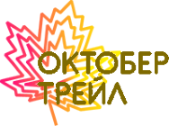
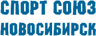
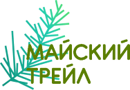
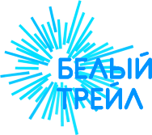
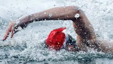

---

# Прошедшие старты

*От недавних к давнишним*

&nbsp;

------

## 2019

---

## :running: ​October Trail

  

**Дата** [13 октября 2019 г.](https://www.strava.com/activities/2784315353)  
**Локация** Н-ск, Ключ-Камышенское плато  
**Тип** трейл  
**Дистанция** 10 км  
**Подъём** 370 м  
**Место** 11 из 213 в абсолюте, 6 в группе  
**Время** 0:57:16  

&nbsp;

## :running: ​Botanic Trail

  

**Дата** [6 октября 2019 г.](https://www.strava.com/activities/2766294683)  
**Локация** Новосибирск, Ботсад СО РАН  
**Тип** трейл  
**Дистанция** 10 км  
**Подъём** 180 м  
**Место** 30/184 (в абсолюте)  
**Время** 0:51:33,1&nbsp;

&nbsp;

## :running: XXII Полумарафон им. А. Раевича {#raevich-2019}

  

**Дата** [7 сентября 2019 г.](https://www.strava.com/activities/2686434693/overview)  
**Локация** Новосибирск, Красный Проспект  
**Тип** шоссейный полумарафон  
**Дистанция** 21,1 км  
**Цель** 1:30:00 и быстрее    
**Время** 1:29:06  
**Изменение** на 0:12:31 лучше [предыдущего](#raevich-2016)  
**Место**  98 из 1296 (в абсолюте)  
**Очерк** [здесь](/articles/2019/altai-routes/) (об одном этапе подготовки)

&nbsp;

## :running: Кросс физкультурника

  

**Дата** [10 августа 2019 г.](https://www.strava.com/activities/2605740636)  
**Локация** Новосибирск, “Красное знамя”  
**Тип** кросс-трейл  
**Дистанция** 18 км  
**Подъём** 340 м  
**Результат** 1:29:02  
**Место** 48/143 (в абсолюте)  

&nbsp;
&nbsp;

## :running::swimmer: Новосибирский акватлон

  

**Дата** [28 июля 2019 г.](https://www.strava.com/activities/2568885275)  
**Локация** Новосибирск, п/о “У моря Обского”  
**Тип** акватлон (бег+плавание)  
**Стиль** вольный  
**Дистанция** 2,5км + 1км + 2,5км  
**Результат** 0:46:27   
**Место** 16/36 (в абсолюте)  
**Изменение** на 4:03 хуже [предыдущего](#aquathlon2018)

&nbsp;

## :swimmer: IronMan 70.3

  

**Дата** [14 июля 2019 г.](https://www.strava.com/activities/2529995102)  
**Локация** Казахстан, Нур-Султан (Астана)  
**Тип** плавание  
**Стиль** вольный  
**Участие** эстафета  
**Дистанция** 1,9 км    
**Результат** 00:39:16  
**Место** 27 из 46 (командный зачет)

&nbsp;

## :swimmer: Кубок Клубов

  

**Дата** [7 июля 2019 г.](https://www.strava.com/activities/2510799247)  
**Локация** Новосибирск, п/о “У моря Обского”  
**Тип** эстафетное плавание  
**Стиль** вольный  
**Дистанция** 1 км   
**Результат** 00:20:56  
**Очерк** [здесь](/articles/2019/open-swim-cup/)

&nbsp;

## :running: ​Пробег памяти В. Рыцарева

  

**Дата** [9 июня 2019 г.](https://www.strava.com/activities/2434958564)  
**Локация** Новосибирск, л/б А. Тульского  
**Тип** кросс  
**Дистанция** 22,5 км  
**Результат** 1:39:55  
**Место** 26/74 (в мужском абсолюте)  
**Изменение** на 5:00 лучше [предыдущего](#rytsarev-2018)

&nbsp;

## :running: ​ЗаБег.РФ

  

**Дата** [19 мая 2019 г.](https://www.strava.com/activities/2379234694)  
**Локация** Новосибирск, ул. Кирова  
**Тип** шоссейный полумарафон  
**Дистанция** 21,1 км  
**Результат** 1:30:53   
**Место** 66 из 822 (в абсолюте)  
**Изменение** на 2:32 лучше [предыдущего](#one-run-2018)  
**Очерк** [здесь](/articles/2019/one-run/)

&nbsp;

## :running: Майский трейл

  

**Дата** [5 мая 2019 г.](https://www.strava.com/activities/2342698150)  
**Локация** Алтайский край, г. Белокуриха  
**Тип** трейл  
**Дистанция** 17 км  
**Высота** 900 м  
**Результат** 2:04:50  
**Место** 7/123 (в абсолюте)   
**Очерк** [здесь](/articles/2019/may-trail/)

&nbsp;

## :ski: Мемориал В. Пелеганчука

  

**Дата** [17 марта 2019 г.](https://www.strava.com/activities/2218593994)  
**Локация** Новосибирск, л/б А. Тульского  
**Тип** лыжный полумарафон  
**Стиль** коньковый  
**Дистанция** план 30, факт 14 км  
**Результат** 0:48:57  
**Место** - *(сошёл с дистанции)*  

&nbsp;

## :running: Белый трейл

  

**Дата** [10 марта 2019 г.](https://www.strava.com/activities/2202957971)  
**Локация** Новосибирск, Обское море  
**Тип** зимний трейл  
**Дистанция** 10 км  
**Результат** 1:05:59  
**Место** 7/68 (в мужском абсолюте)  

&nbsp;

## :ski: Гонка преследования

  

**Дата** [6 января 2019 г.](https://www.strava.com/activities/2072321677)  
**Локация** Новосибирск, л/б А. Тульского  
**Тип** лыжная гонка  
**Этап** любительский  
**Стиль** коньковый  
**Дистанция** 5 км  
**Результат** 0:21:57  
**Место** 5/8  

&nbsp;

## :swimmer: Новогодний километр

  

**Дата** [6 января 2019 г.](https://www.strava.com/activities/2058690770)  
**Локация** Новосибирск, бассейн НГУ  
**Тип** плавание в бассейне  
**Стиль** кроль на груди  
**Дистанция** 1 км  
**Результат** 0:19:39  
**Место** 22/32 (в мужском абсолюте)  
**Изменение** на 0:16 хуже [предыдущего](#new-year-km-2018)

&nbsp;

&nbsp;

------

## 2018

------

## :running: Абсолют Московский Марафон

  

**Дата** [23 сентября 2018 г.](https://www.strava.com/activities/1860175584)  
**Локация** Москва, Лужники  
**Тип** шоссейный марафон  
**Дистанция** 42,2 км  
**Результат** 3:40:24  
**Место** 2238 из 9181 (в абсолюте)

&nbsp;

## :swimmer::running: SwimRun Atlant

  

**Дата** [18 августа 2018 г.](https://www.strava.com/activities/1779549590)  
**Локация** Новосибирск, база “Атлант”  
**Тип** swim-run  
**Дистанция** &approx;9,5 км  
**Этапов** 5 кросс + 4 плавание  
**Результат** 1:15:09  
**Место** 3/6 (в одиночном зачете)  
**Очерк** [здесь](/articles/2018/swimrun/)

&nbsp;

## :running::swimmer: Новосибирский акватлон {#aquathlon2018}

  

**Дата** [29 июля 2018 г.](https://www.strava.com/activities/1734638571)  
**Локация** Новосибирск, п/о “У моря Обского”  
**Тип** акватлон (бег+плавание)  
**Стиль** вольный  
**Дистанция** 2,5км + 1км + 2,5км  
**Результат** 0:42:24  
**Место** 30/59 (в абсолюте)

&nbsp;

## :swimmer: Переплыв через Обь

  

**Дата** [22 июля 2018 г.](https://www.strava.com/activities/1719202568)  
**Локация** Новосибирск, река Обь  
**Тип** плавание на открытой воде  
**Дистанция** &approx;3,8 км  
**Результат** 0:36:36  
**Место** 34/133 (в мужском абсолюте)

&nbsp;

## :running: ​Пробег памяти В. Рыцарева {#rytsarev-2018}

  

**Дата** [10 июня 2018 г.](https://www.strava.com/activities/1628523134)  
**Локация** Новосибирск, л/б А. Тульского  
**Тип** кросс  
**Дистанция** 22,5 км  
**Результат** 1:44:55  
**Очерк** [здесь](/articles/2018/rytsarev-trail/)

&nbsp;

## :running: ЗаБег.РФ {#one-run-2018}

  

**Дата** [20 мая 2018 г.](https://www.strava.com/activities/1583397255)  
**Локация** Новосибирск, ул. Кирова  
**Тип** шоссейный полумарафон  
**Дистанция** 20,7 км  
**Результат** 1:33:25   
**Изменение** на 2:52 лучше [прошлого](#one-run-2017)

&nbsp;

## :ski: Мемориал В. Пелеганчука

  

**Дата** [18 марта 2018 г.](https://www.strava.com/activities/1458521411)  
**Локация** Новосибирск, л/б А. Тульского  
**Тип** лыжный полумарафон  
**Стиль** коньковый  
**Дистанция** 30 км  
**Результат** 2:06:00  
**Место** 93 в абсолюте, 58 в группе

&nbsp;

## :swimmer: Твой новогодний километр {#new-year-km-2018}

  

**Дата** [5 января 2018 г.](https://www.strava.com/activities/1341511967)  
**Локация** Новосибирск, бассейн АкадемВолна  
**Тип** плавание в бассейне  
**Стиль** кроль на груди  
**Дистанция** 1 км  
**Результат** 0:19:23  
**Место** 14 в общем зачёте

&nbsp;

------

## 2017

------

## :construction: Гонка героев

  

**Дата** июнь, июль 2017 г.  
**Локация** Новосибирск, полигон НВВКУ  
**Тип** кросс с препятствиями  
**Участие** взводом и лично (чемпионат)   
**Дистанция** &approx;9 км  
**Препятствий** &approx;32 (с учетом водных)  
**Результат** 1:34:00  
**Место** 17 в абсолюте, дисквалифицирован

&nbsp;

## :running: Красмарафон “Июльская жара”

  

**Дата** 2 июля 2017  
**Локация** Красноярск, пл. Мира  
**Тип** шоссейный полумарафон  
**Дистанция** 21,1 км  
**Результат** 1:46:19

&nbsp;

## :running: ЗаБег.РФ {#one-run-2017}

  

**Дата** 21 мая 2017 г.  
**Локация** Новосибирск, ул. Кирова  
**Тип** шоссейный полумарафон  
**Дистанция** 20,7 км  
**Результат** 1:36:17

&nbsp;

---

## 2016

------

## :running: XIX Полумарафон им. А. Раевича {#raevich-2016}

  

**Дата** 10 сентября 2016 г.  
**Локация** Новосибирск, Красный Проспект  
**Тип** шоссейный полумарафон  
**Дистанция** 21,1 км  
**Результат** 1:41:37

&nbsp;

## :construction: Гонка героев

  

**Дата** 3 июля и 28 августа 2016 г.  
**Локация** Новосибирск, полигон НВВКУ  
**Тип** кросс с препятствиями  
**Участие** в составе взвода  
**Дистанция** &approx;8 км  
**Препятствий** 35 (с учетом водных)  
**Результат** *[командный зачёт]*